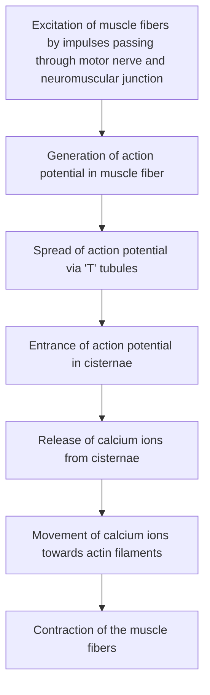
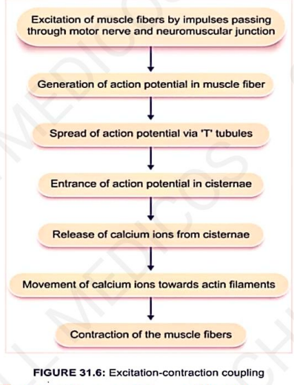
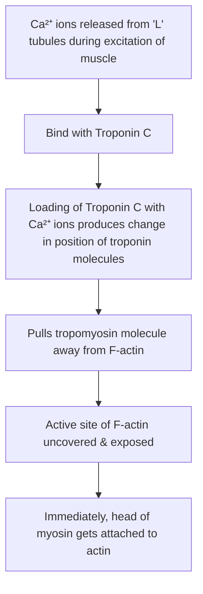
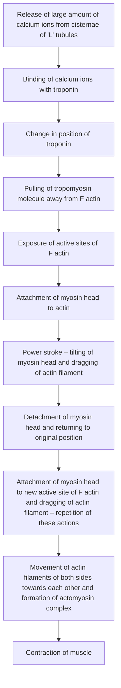
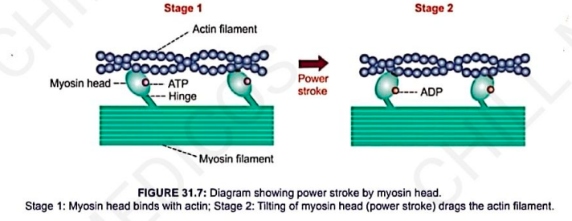
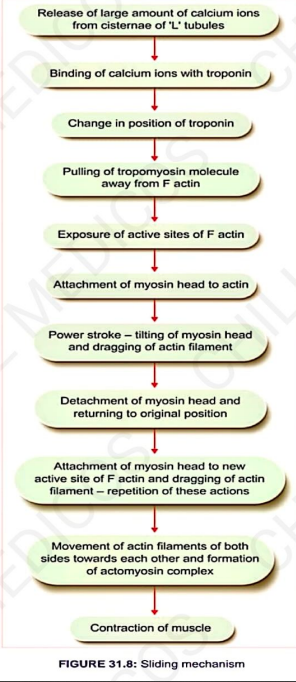
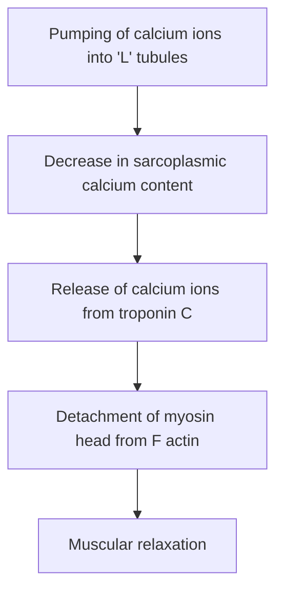
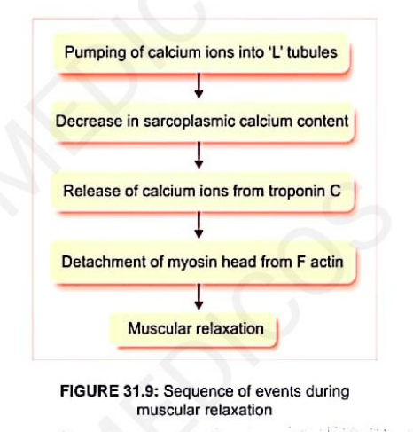

# MECHANISM OF MUSCLE CONTRACTION

* **1. Physical Change :—** Change in length of muscle fibers / change in tension developed in muscle.
* **2. Chemical Change :—** Energy necessary for muscular contraction is liberated during processes of breakdown & resynthesis of ATP.
* **3. Histological Change :—**
  * a. **Molecular Basis of Muscular Contraction :** Molecular mechanism responsible for formation of actomyosin complex (includes 3 stages: Excitation–Contraction Coupling, Role of Troponin & Tropomyosin, Sliding Mechanisms).
  * b. **Actomyosin Complex :**
    * In relaxed state of muscle $\longrightarrow$ Thin actin filaments from opposite ends of sarcomere are away from each other, leaving a broad 'H' zone.
    * During contraction of muscle $\longrightarrow$ Actin filaments glide over myosin to form **actomyosin complex**.

---

## 1. EXCITATION–CONTRACTION COUPLING

* **Definition :** Process that occurs between excitation and contraction of muscle.
* Involves a series of activities responsible for contraction of excited muscles.

### Stages of Excitation–Contraction Coupling:
* $\text{Ca}^{2+}$ ions from sarcoplasm move towards actin filaments to produce contraction.
* **$\text{Ca}^{2+}$ ions form the link or coupling material** between excitation and contraction of muscle.

> 

---

## 2. ROLE OF TROPONIN AND TROPOMYOSIN

* **Head of myosin molecules** has a strong tendency to get attached with active site of F-actin.
* **In relaxed condition :** Active site of F-actin is covered by **tropomyosin**.

---

## 3. SLIDING MECHANISM

* **Formation of Actomyosin Complex $\longrightarrow$ Sliding Theory :**
Explains how actin filaments slide over myosin filaments and form actomyosin complex during muscular contraction *(also called **Ratchet Theory / Walk-Along Theory**)*.
* **Each cross-bridge from myosin filaments has 3 components :—**
* a. Hinge
* b. An arm
* c. A head

* **Power Stroke :** Myosin head is tilted towards arm so that actin filament is dragged along with it. Tilting of head is called **power stroke**.

### Detailed Steps of Sliding Mechanism:

> 

---

### CHANGES IN SARCOMERE DURING MUSCULAR CONTRACTION

* a. **Length of all sarcomeres decreases** as 'Z' lines come closer.
* b. **Length of all 'I' bands decreases** since actin filaments from opposite sides overlap.
* c. **'H' zone either decreases or disappears.**
* d. **Length of 'A' band remains same.**

> 

---

## ENERGY FOR MUSCULAR CONTRACTION

* **Energy for movement of myosin head (power stroke) :—**
Obtained by breakdown of $\text{ATP}$ into $\text{ADP} + \text{P}_\text{i}$.
* Head of myosin has a **site for ATP**; head itself can act as enzyme **ATPase**.
* **Sequence of Events :—**
* a. When tropomyosin moves to expose active sites $\longrightarrow$ Head attaches to active site:

$$\text{ATP} \xrightarrow{\text{ATPase}} \text{ADP} + \text{P}_\text{i}$$

* b. Energy released is utilized for contraction.
* c. When head is tilted, $\text{ADP} + \text{P}_\text{i}$ is released and **new ATP molecule binds with head**.

---

## RELAXATION OF MUSCLE

* **Relaxation occurs** when $\text{Ca}^{2+}$ ions are pumped back into L-tubules.
* **Detachment of myosin from actin** obtains energy from breakdown of ATP.
* **Muscular relaxation is an ACTIVE process.**

### Sequence of Events During Muscular Relaxation:

> 