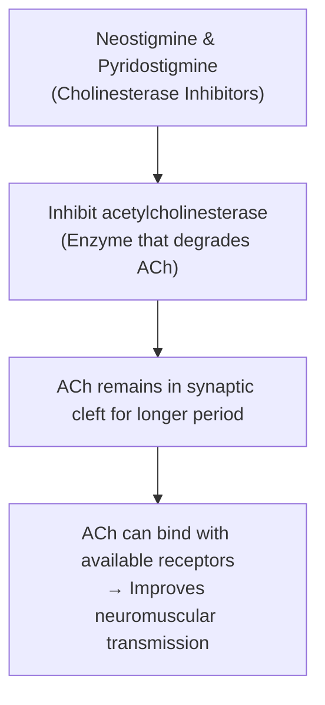

# MYASTHENIA GRAVIS

* **An autoimmune disease of neuromuscular junction** caused by antibodies to cholinergic receptors.
* **Characterised by grave weakness of muscle** due to inability of neuromuscular junction to transmit impulses.

---

### CAUSES

* Caused due to the development of **autoantibodies (IgG autoantibodies)** against receptors of acetylcholine.
  $$\downarrow$$
* Antibodies **prevent binding of acetylcholine** with its receptors or **destroy the receptors**.

---

### SYMPTOMS

#### Muscles More Susceptible :—
* a. Muscles of neck
* b. Limbs
* c. Eyeballs
* d. Muscles for eyelid movements, chewing, swallowing, speech & respiration

#### Clinical Manifestations :—
* a. **Slow and weak** muscular contraction.
* b. **Inability to maintain prolonged contraction** of skeletal muscle.
* c. **Quick fatigability**.
* d. **Weakness & fatigability** of arms & legs.
* e. **Double vision & droopy eyelids** *(weakness of ocular muscles)*.
* f. **Difficulty in swallowing**.
* g. **Difficulty in speech**.

---

### TREATMENT

* **By administration of cholinesterase inhibitors** such as **neostigmine & pyridostigmine**.

