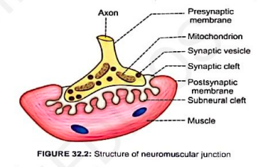
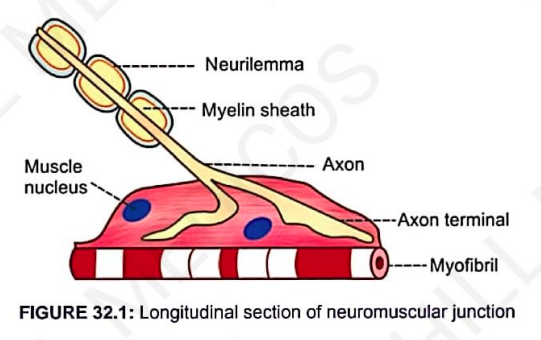
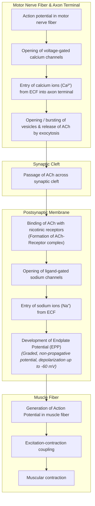
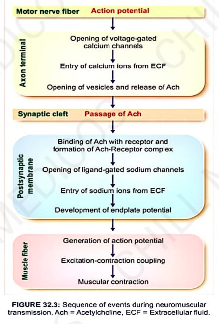

# NEUROMUSCULAR JUNCTION

* **Definition :** Junction between terminal branch of nerve fiber and muscle fiber.
* **Structure :** Skeletal muscle fiber innervated by motor nerve fiber.

> 

---

### AXON TERMINAL AND MOTOR ENDPLATE

* Terminal branch of nerve fiber.
* **When axon comes close to muscle fiber :**
  * It loses myelin sheath.
  * Axis cylinder exposed *(this portion expanded like a bulb)* $\longrightarrow$ **called motor endplate**.
* **Axon Terminal Contains :—**
  * a. **Mitochondria :** Contain ATP *(source of energy for synthesis of ACh)*.
  * b. **Synaptic Vesicles :** Contain neurotransmitters, acetylcholine (ACh) synthesized.

---

### SYNAPTIC TROUGH OR GUTTER

* Motor endplate invaginates inside muscle fiber $\longrightarrow$ **forms a depression (gutter)**.

---

### SYNAPTIC CLEFT

* Membrane of nerve ending $\longrightarrow$ **Presynaptic membrane**.
* Membrane of muscle fiber $\longrightarrow$ **Postsynaptic membrane**.
* **Synaptic Cleft :** Space between these 2 membranes.
  * Contains **basal lamina** *(thin layer of spongy reticular matrix through which extracellular fluid diffuses)*.
  * **Acetylcholinesterase (AChE)** is attached to matrix of basal lamina.

---

### SUBNEURAL CLEFTS

* Postsynaptic membrane thrown into **numerous folds**.
* Postsynaptic membrane contains receptors called **nicotinic acetylcholine receptors**.

> 

---

# NEUROMUSCULAR TRANSMISSION

* **Definition :** The transfer of information from motor nerve ending to muscle fiber through neuromuscular junction.
  * Mechanism by which motor nerve impulses initiate muscle contraction.

### Events of Neuromuscular Transmission:
* a. Release of acetylcholine
* b. Action of acetylcholine
* c. Development of endplate potential
* d. Development of miniature endplate potential
* e. Destruction of acetylcholine

---

### SEQUENCE OF EVENTS (FLOWCHART)

---

## DETAILED EVENTS

### 1. Release of ACh

* $\text{Ca}^{2+}$ ions cause bursting of vesicles by forcing synaptic vesicles to move and fuse with presynaptic membrane.
* By **exocytosis**, acetylcholine diffuses into synaptic cleft.

> 

---

### 2. Action of ACh

* After entering cleft, ACh molecules bind with **nicotinic receptors** present in postsynaptic membrane *(ACh–Receptor complex)*.
* Increases permeability of postsynaptic membrane for $\text{Na}^+$ by **opening ligand-gated $\text{Na}^+$ channels**.

---

### 3. Development of Endplate Potential

* The change in RMP when impulse reaches neuromuscular junction.
* Slight depolarisation up to **$-60\text{ mV}$** *(as $\text{Na}^+$ ions enter)*.
* **Endplate Potential (EPP) :** Graded potential, non-propagative *(causes development of action potential in muscle fiber)*.

---

### 4. Development of Miniature Endplate Potential (MEPP)

* A weak endplate potential in neuromuscular junction that is developed by the **release of ACh from axon terminal**.
* **Amplitude :** $0.5\text{ mV}$.
* Miniature endplate potential cannot produce action potential in muscle alone.
* When ACh is released continuously $\longrightarrow$ miniature endplate potentials are **added together** and finally produce endplate potential $\longrightarrow$ **results in action potential**.

---

### 5. Destruction of Acetylcholine

* Acetylcholine released is **destroyed very quickly** (within $1\text{ msec}$) by **acetylcholinesterase (AChE)**.
* Prevents repeated excitation of muscle fiber $\longrightarrow$ **allows muscle to relax**.

$$\text{Acetylcholine} \xrightarrow{\text{Acetylcholinesterase}} \text{Acetate} + \text{Choline (Inactive)}$$

$$\downarrow$$

$$\text{Taken back into axon terminal by reuptake process}$$

---

## NEUROMUSCULAR BLOCKERS

* **Definition :** Drugs which prevent transmission of impulses from nerve fibers to muscle fiber through neuromuscular junctions.
* **Examples & Mechanisms :—**
* a. **Curare :** By combining with ACh receptors.
* b. **Bungarotoxin :** By blocking ACh receptors.
* c. **Botulinum Toxin :** Prevents release of ACh.
* d. **Succinylcholine & Carbamylcholine :** Act like excess ACh *(depolarizing blockers)*.

