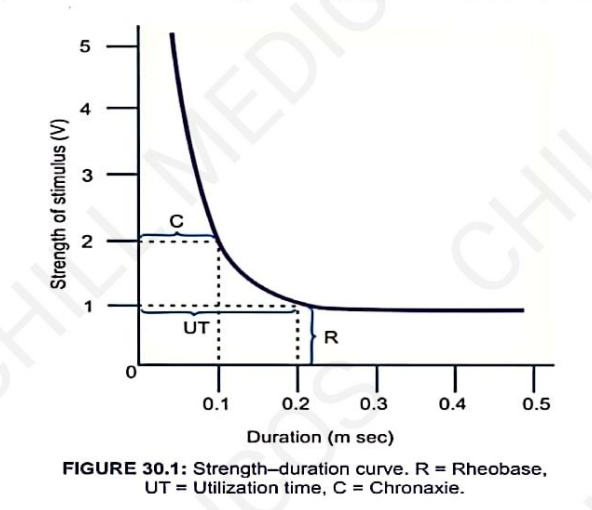
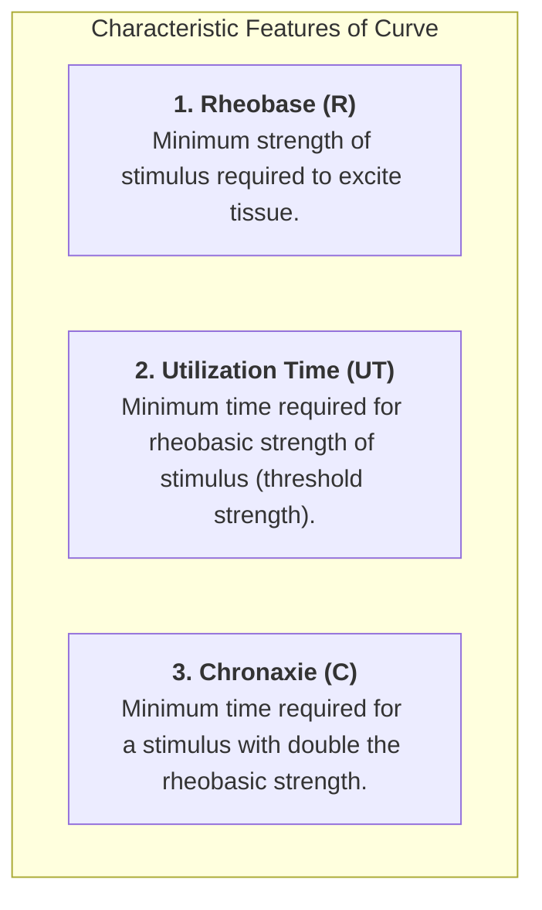
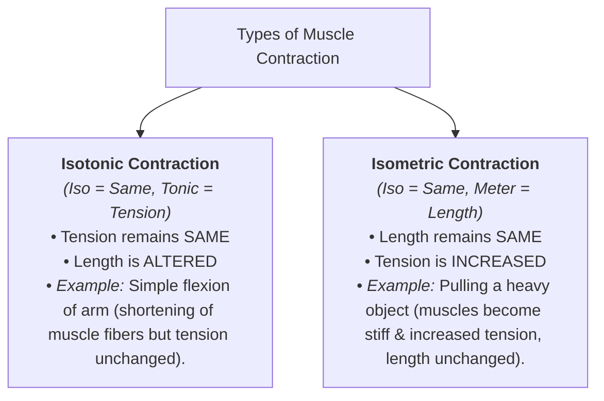
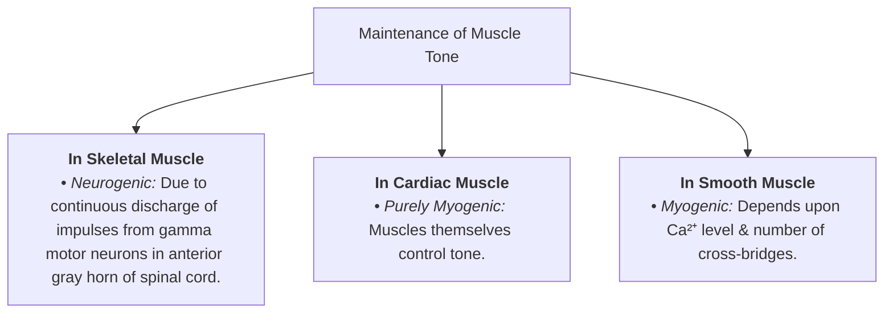

# PROPERTIES OF SKELETAL MUSCLE

* **Primary Properties :—**
  * a. **Excitability :** Reaction / response of a tissue to irritation / stimulation.
  * b. **Contractility**
  * c. **Muscle Tone**

---

## 1. EXCITABILITY

### STRENGTH–DURATION CURVE
* Graph that demonstrates the exact relationship between **strength** and **duration** of a stimulus.

> 

* **Significance of Chronaxie :—**
* Longer the chronaxie, **lesser the excitability**.
* **Values :—**
* In humans = 0.08 – 0.32 msec
* In frogs = 3 msec

---

## 2. CONTRACTILITY

* **Response of muscle to a stimulus.**
* **Contraction :** Internal events of muscle with change in either length or tension of muscle fibers.

### Types of Contraction

---

### FRANK–STARLING LAW

* States that the **force of contraction is directly proportional to the initial length of muscle fibers**.
* **Effects of Increasing Weight in Afterloaded Condition :—**
* a. Force of contraction decreases.
* b. Latent period prolongs.
* c. Contraction & relaxation periods shorten.

> **Work done in free-loaded condition is more than in afterloaded condition.**

---

### REFRACTORY PERIOD

* **Definition :** Period at which the muscle does not show any response to a stimulus.
* *Reason:* Because one action potential is in progress in the muscle.
* Muscle is unexcitable to further stimulation until it is repolarized.

#### Classification of Refractory Period:

* a. **Absolute Refractory Period (ARP) :** Period during which muscle does not show any response at all.
* b. **Relative Refractory Period (RRP) :** Period during which muscle shows some response, if strength of stimulus is increased to maximum.

---

### REFRACTORY PERIOD COMPARISON

| Feature | Skeletal Muscle | Cardiac Muscle |
| --- | --- | --- |
| **Duration** | Very short (Total = 0.01 sec) | Long (Total = 0.53 sec) |
| **Absolute Refractory Period (ARP)** | Falls during 1ˢᵗ half of latent period (0.005 sec) | Extends throughout contraction period (0.27 sec) |
| **Relative Refractory Period (RRP)** | Extends during 2ⁿᵈ half of latent period (0.005 sec) | Extends during 1ˢᵗ half of relaxation period (0.26 sec) |
| **Context** | Whole of latent period is refractory period | Long compared to skeletal muscle |

#### Significance of Long Refractory Period in Cardiac Muscle:

* Cardiac muscle **does not show :—**
* a. Complete summation of contraction
* b. Fatigue
* c. Tetanus

---

## 3. MUSCLE TONE

* **Continuous & partial contraction of muscles** with a certain degree of vigor & tension.

### Maintenance of Muscle Tone

---

### APPLIED PHYSIOLOGY

*(Abnormalities of Muscle Tone)*

* a. **Hypertonia** (Increased muscle tone)
* b. **Hypotonia** (Decreased muscle tone)
* c. **Myotonia** (Slow relaxation after contraction)
