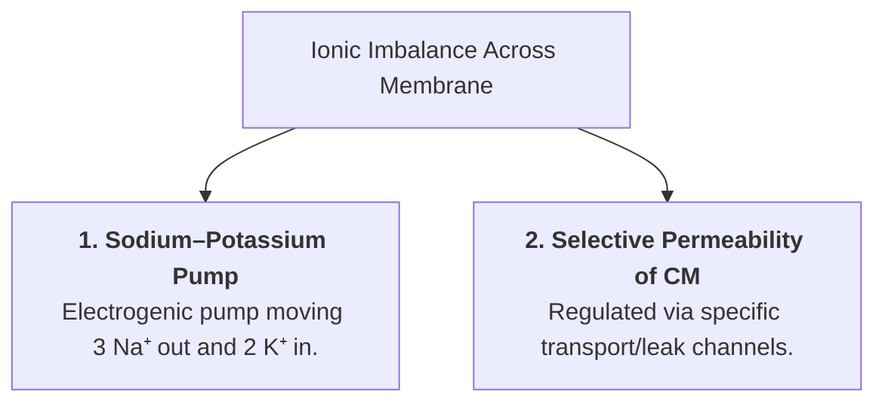
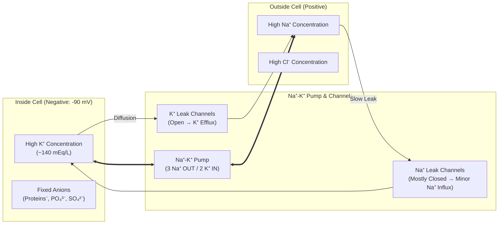
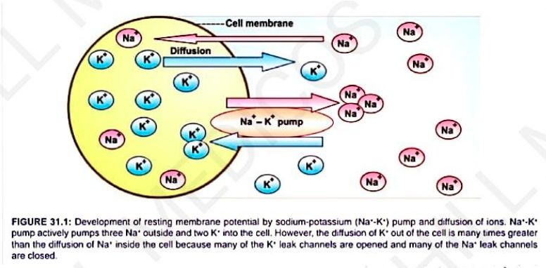

# RESTING MEMBRANE POTENTIAL (RMP)

* **Definition :** Electrical potential difference (voltage) across cell membrane (between inside & outside of cell) under resting condition.
* **Also called :—**
  * a. Membrane potential
  * b. Transmembrane potential
  * c. Transmembrane potential difference
  * d. Transmembrane potential gradient
* **RMP of human skeletal muscle :—** $-90\text{ mV}$.

---

## IONIC BASIS OF RMP

* Development and maintenance of RMP is carried out by movement of ions, which produce ionic imbalance across cell membrane:
  $$\downarrow$$
  $$\text{Development of more positive outside \& more negative inside}$$
  $$\downarrow$$
  $$\text{Ionic imbalance produced by 2 factors:}$$

---

### 1. SODIUM–POTASSIUM PUMP

* $\text{Na}^+$ & $\text{K}^+$ ions actively transported in opposite directions across the cell membrane (CM) by means of an **electrogenic pump**:
* Pumps **$3\text{ Na}^+$ out** of the cell.
* Pumps **$2\text{ K}^+$ into** the cell.

* **Leads to negativity inside & positivity outside of cell.**

---

### 2. SELECTIVE PERMEABILITY OF CELL MEMBRANE (CM)

* Permeability of cell membrane depends largely on transport channels *(selective for movement of specific ions)*.
* **2 Types of Channels :—**
* a. Channels for major anions like proteins
* b. Leak channels

---

#### A. Channels for Major Anions Like Proteins

$$\text{Negatively charged large substances [Proteins, Organic phosphate \& Sulfate compounds]}$$

$$\downarrow$$

$$\text{Channels are absent / closed}$$

$$\downarrow$$

$$\text{Substances remain inside cell (Development \& maintenance of negativity inside cell)}$$

---

#### B. Leak Channels

* **Passive channels** that maintain resting membrane potential by allowing movement of positive ions ($\text{Na}^+$ & $\text{K}^+$) across cell membrane.
* **Distribution of 3 ions ($\text{Na}^+$, $\text{Cl}^-$, and $\text{K}^+$) :—**
* $\text{Na}^+$ and $\text{Cl}^-$ are more outside.
* $\text{K}^+$ is more inside.

* $\text{Cl}^-$ ion channels are mostly closed in resting conditions *(retained outside)*.

$$\text{Na}^+ \text{ is actively transported OUT of cell (against concentration gradient)}$$

$$\text{K}^+ \text{ is actively transported INTO cell (against concentration gradient)}$$

$$\downarrow$$

$$\text{Because of concentration gradient:}$$

$$\text{Na}^+ \text{ diffuses back INTO cell through Na}^+ \text{ leak channels}$$

$$\text{K}^+ \text{ diffuses OUT of cell through K}^+ \text{ leak channels}$$

---

### RESTING STATE PERMEABILITY

* **In resting conditions :—**
* Almost all $\text{K}^+$ leak channels are opened.
* Most of $\text{Na}^+$ leak channels are closed.
* $\downarrow$
* Maintain concentration gradient / equilibrium.

---

### STOPPAGE OF $\text{K}^+$ EFFLUX

* **After establishment of RMP, efflux of $\text{K}^+$ ions stops because :—**
* a. Positivity outside of cell repels positive $\text{K}^+$ ions.
* b. Negativity inside cell attracts positive $\text{K}^+$ ions.

---

### KEY VALUES & APPLIED ASPECTS

* **Concentration of $\text{K}^+$ inside cell :—** $\approx 140\text{ mEq/L}$.
* **Negativity inside fibers :—**
* Inside muscle fiber = $-90\text{ mV}$
* Inside nerve fiber = $-70\text{ mV}$

> **Hyperpolarization :—**
> If $\text{K}^+$ is not present / decreased, negativity inside increases beyond $-120\text{ mV}$.

> 