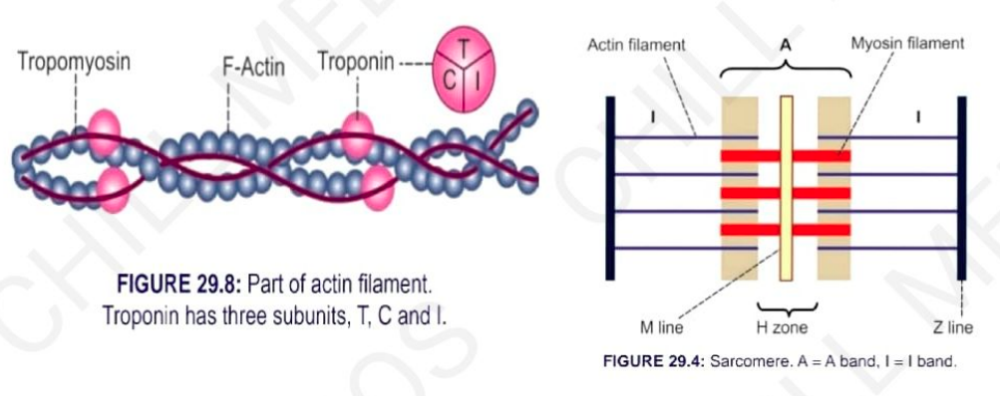
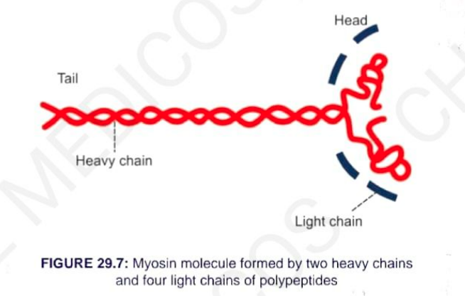
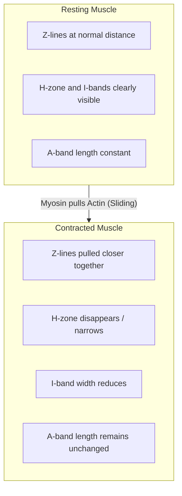
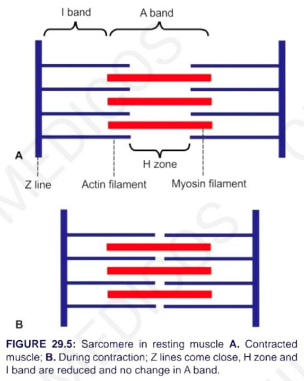

# SARCOMERE

### DEFINITION
* **Sarcomere is defined as** the structural and functional unit of skeletal muscle.
* **Basic contractile unit** of the muscle.

---

### EXTENT
* Sarcomere extends **between two Z-lines** of myofibril *(each myofibril contains many sarcomeres)*.
* **In relaxed state:** Average length is **2 – 3 μm**.

---

### COMPONENTS
* Each myofibril consists of an alternate:
  * **Dark 'A' band** (Anisotropic band)
  * **Light 'I' band** (Isotropic band)
* In the middle of the 'A' band, there is a lighter area called the **H-zone**.
* In the middle of the H-zone lies the middle part of the myosin filament called the **M-line** *(contains myosin-binding proteins)*.

---

## ELECTRON MICROSCOPIC STUDY OF SARCOMERE

* Sarcomere consists of many thread-like structures called **myofilaments**:
  * a. **Actin filaments** (Thin filaments)
  * b. **Myosin filaments** (Thick filaments)

---

### 1. ACTIN FILAMENTS
* **Thin filaments:**
  * **Diameter:** 20 Å
  * **Length:** 1 μm
* Extend from either side of the **Z-lines**, run across the **'I' band**, and enter into the **'A' band** up to the **'H' zone**.

#### Actin Molecule Components:
* a. **F-Actin (Fibrous Actin):** Double-stranded helix that possesses active sites.
* b. **G-Actin (Globular Actin):** Polymer of small globular proteins.
* c. **Tropomyosin:** Double-stranded protein wrapping around F-actin.
* d. **Troponin:** Complex of three subunits:
  * **Troponin T (T):** Binds to tropomyosin
  * **Troponin C (C):** Binds to calcium ions ($Ca^{2+}$)
  * **Troponin I (I):** Inhibits actin–myosin interaction

> 

---

### 2. MYOSIN FILAMENTS
* **Thick filaments:**
  * **Diameter:** 115 Å
  * **Length:** 1.5 μm
* Situated in the **'A' band**.

#### Myosin Molecules (~200 per filament):
* Belongs to **Myosin II class** present in sarcomere.
* Composed of:
  * a. **Tail Portion:** Made up of two heavy chains (H-chains) coiled together.
  * b. **Head Portion:** Made up of the end portion of two heavy chains (globular head portion) plus four light chains.
    * Contains an **Actin-binding site**.
    * Contains an **ATP-binding site** (ATPase activity).

> 

---

## CROSS-BRIDGES & SLIDING MECHANISM

* **Myosin heads attach themselves** to the actin filaments forming cross-bridges.
* **Sliding Mechanism / Ratchet Mechanism:**
  * The head tilts and pulls the actin filament towards the center of the sarcomere during muscle contraction.

> 

### Changes in Banding During Contraction:

* a. **Z-lines:** Come closer together.
* b. **H-zone:** Reduces or completely disappears.
* c. **I-band:** Length reduces / narrows.
* d. **A-band:** Length remains unchanged.

