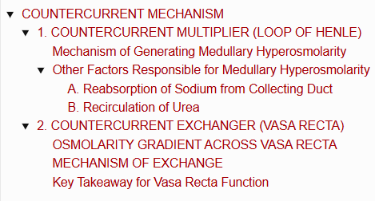
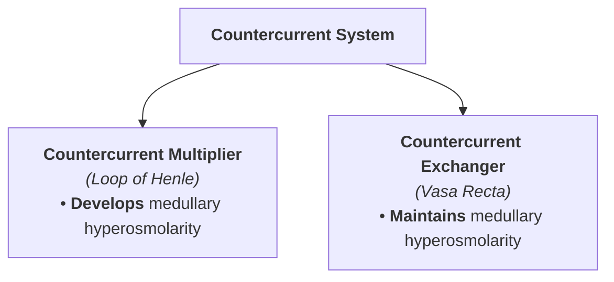
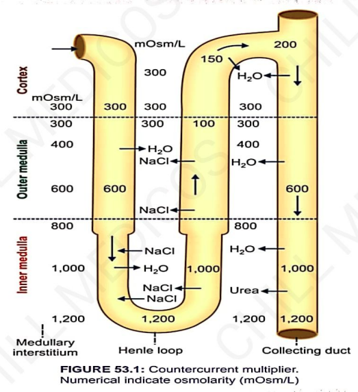
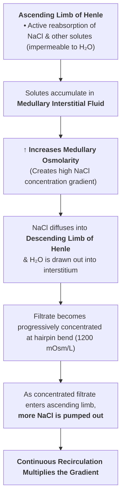
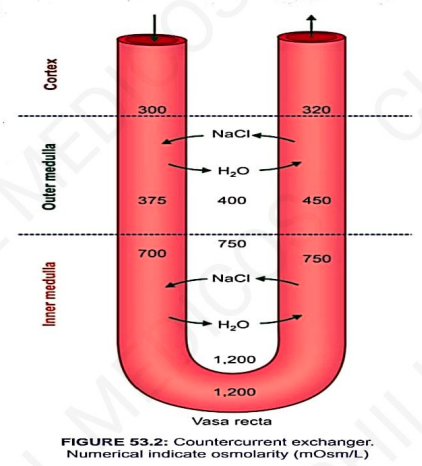
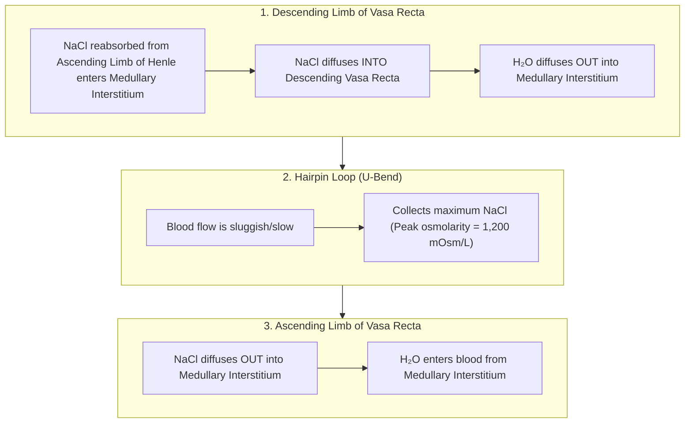

# COUNTERCURRENT MECHANISM

> ### Headings
> 

* **Definition :** A system of **U-shaped tubules (tubes)** in which fluid flows in **opposite directions** through the two parallel limbs of the loop.
* **Components of the Countercurrent System :—**
  * 1. **Countercurrent Multiplier :** Loop of Henle
  * 2. **Countercurrent Exchanger :** Vasa Recta

---

## 1. COUNTERCURRENT MULTIPLIER (LOOP OF HENLE)

* **Primary Role :** Responsible for the **generation/development of hyperosmolarity** in the medullary interstitial fluid and creating the vertical **medullary osmolar gradient** ($300\text{ to }1200\text{ mOsm/L}$).
* **Role of Juxtamedullary Nephrons :** Play the major role because their loops of Henle are exceptionally **long and extend deep into the renal medulla**.

---

### Mechanism of Generating Medullary Hyperosmolarity

> 

* **Solute Recirculation & Multiplication :**

$$\text{NaCl and } \text{Cl}^- \text{ ions are repeatedly recirculated between ascending and descending limbs}$$

$$\downarrow$$

$$\text{More solute is added to the tubular filtrate than is excreted}$$

$$\downarrow$$

$$\text{Multiplies the solute concentration in filtrate } \longrightarrow \uparrow \mathbf{Medullary \ Interstitial \ Osmolarity}$$

---

### Other Factors Responsible for Medullary Hyperosmolarity

#### A. Reabsorption of Sodium from Collecting Duct

* In the medullary portion of the collecting duct, active **$\text{Na}^+$ reabsorption** into the medullary interstitium further enhances interstitial hyperosmolarity.

#### B. Recirculation of Urea

* The cortical collecting duct is relatively impermeable to urea.
* In the distal convoluted tubule (DCT) and cortical collecting duct (CT), water is reabsorbed under the influence of **Antidiuretic Hormone (ADH)** $\longrightarrow \uparrow$ increases the intraluminal concentration of urea.
* **Medullary Urea Diffusion :**

$$\text{Concentrated urea reaches Inner Medullary Collecting Duct (IMCD)}$$

$$\downarrow$$

$$\text{Diffuses down its concentration gradient into the medullary interstitium}$$

$$\downarrow$$

$$\textbf{Urea recirculation accounts for } \mathbf{50\%} \textbf{ of total hyperosmolarity in the inner medulla}$$

* **Urea Transporters :** Mediated by specific transporters (**$\text{UT-A}_1$** and **$\text{UT-A}_3$**), which are activated and upregulated by **$\text{ADH}$**.

---

## 2. COUNTERCURRENT EXCHANGER (VASA RECTA)

* **Primary Role :** Responsible for the **maintenance of the medullary gradient** and hyperosmolarity created by the multiplier.
* **Anatomical Alignment :** Vasa recta acts as an exchanger due to its U-shaped hairpin loops arranged alongside the loop of Henle:
* **Descending limb of vasa recta** runs parallel to the **ascending limb of Henle**.
* **Ascending limb of vasa recta** runs parallel to the **descending limb of Henle**.

---

### OSMOLARITY GRADIENT ACROSS VASA RECTA

<table>
  <thead>
    <tr>
      <th align="left">Renal Zone</th>
      <th align="center">Descending Limb (Arterial Side)</th>
      <th align="center">Medullary Interstitium</th>
      <th align="center">Ascending Limb (Venous Side)</th>
    </tr>
  </thead>
  <tbody>
    <tr>
      <td><b>Cortex</b></td>
      <td align="center"><b>300 mOsm/L</b></td>
      <td align="center">—</td>
      <td align="center"><b>320 mOsm/L</b></td>
    </tr>
    <tr>
      <td><b>Outer Medulla</b></td>
      <td align="center"><b>375 mOsm/L</b></td>
      <td align="center"><b>400 mOsm/L</b></td>
      <td align="center"><b>450 mOsm/L</b></td>
    </tr>
    <tr>
      <td><b>Inner Medulla</b></td>
      <td align="center"><b>700 mOsm/L</b></td>
      <td align="center"><b>750 mOsm/L</b></td>
      <td align="center"><b>750 mOsm/L</b></td>
    </tr>
    <tr>
      <td><b>Hairpin Bend / Tip</b></td>
      <td align="center"><b>1,200 mOsm/L</b></td>
      <td align="center"><b>1,200 mOsm/L</b></td>
      <td align="center"><b>1,200 mOsm/L</b></td>
    </tr>
  </tbody>
</table>

---

### MECHANISM OF EXCHANGE

---

### Key Takeaway for Vasa Recta Function

* **Slow Blood Flow :** Sluggish medullary blood flow prevents the rapid "washout" of medullary hyperosmolar solutes.
* **Passive Exchange :**

$$\textbf{Vasa recta retains NaCl in the medullary interstitium and removes excess water}$$

$$\downarrow$$

$$\textbf{Maintains medullary interstitial hyperosmolarity}$$

* **Recycling of Urea :** Urea also diffuses into the descending vasa recta and exits via the ascending vasa recta, contributing to the continuous intra-renal recycling of urea.

---
