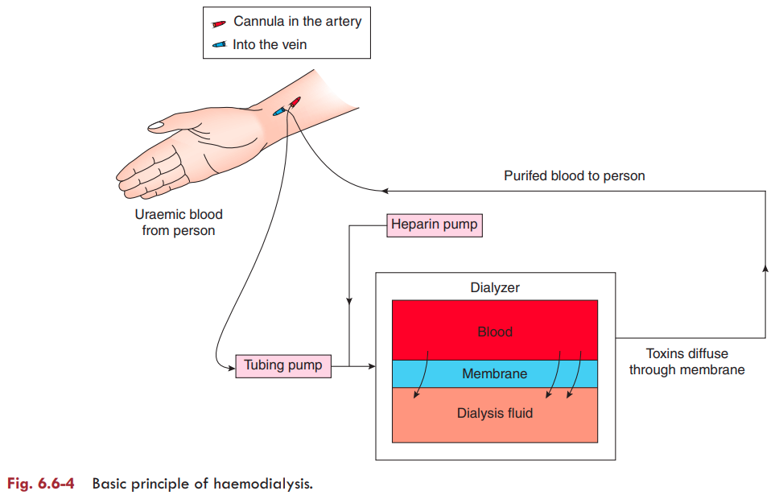

# Dialysis

### Definition

**Dialysis** is the diffusion of solutes from an area of **higher concentration → lower concentration** through a **semipermeable membrane**.

It is used to remove waste products from the blood in **renal failure**, especially **uraemia**.

### Uraemia

Occurs when **>75% of nephrons are damaged** and is characterized by:

* ↑ **Nitrogenous waste products** in blood
* **Metabolic acidosis**
* **Hyperkalaemia**

### Types of Dialysis

1. **Haemodialysis (artificial kidney)**
2. **Peritoneal dialysis**

---

#### 1. Haemodialysis / Artificial Kidney 

* Usually performed in hospital for **3–5 hours** through an IV access.
* Blood is passed through a **long, coiled semipermeable cellophane tube** immersed in dialysing fluid.
* **Heparin** is used as an anticoagulant.
* About **500 mL blood** is present in the machine at a time.
* Dialysed blood is returned to the patient through a **peripheral vein**.

##### Dialysing fluid

Its composition is similar to plasma but:

* **Free of waste products** → urea, uric acid, etc.
* ↓ **Na⁺, K⁺ and Cl⁻** compared with uraemic blood
* ↑ **Glucose, HCO₃⁻ and Ca²⁺**

##### Mechanism 

The cellophane membrane:

* Allows diffusion of **small dissolved substances**
* Does **not allow plasma proteins** to pass

Therefore:
**Urea + other toxic wastes → blood → dialysing fluid**

At the same time, abnormal electrolyte levels are corrected.

* Severe uraemia → usually **3 times/week**
* Can save life in **acute renal failure**
* Can prolong life in **chronic renal failure**

**Important:** Dialysis only **partially replaces the excretory function** of kidneys; it does **not replace their endocrine and metabolic functions**.

> 

---

#### 2. Peritoneal Dialysis 

* **Peritoneum acts as the semipermeable membrane.**
* About **2 L dialysing fluid** is introduced into the peritoneal cavity through an intraperitoneal catheter.
* Fluid remains for **15–20 min (dwell time)** → exchange occurs.
* Fluid is then drained and measured.
* One such process = **one cycle**.
* Usually performed at **6-hour intervals → 4 cycles/day**.
* Can be performed **at home/work**, so hospitalization is not required.
* Useful in **young children and elderly patients with cardiovascular disorders**.
* Prolongs survival in chronic renal failure.

---

## Renal Transplantation

### Definition

**Renal transplantation** is the surgical transplantation of a healthy kidney into a patient with **chronic renal failure**. It is the **definitive treatment** for chronic renal failure.

### Important Points

1. **Donor**

   * Graft may be obtained from:

     * **Cadaver donor**
     * **Sibling**
     * **Parent**
     * **Twin** *(best donor)*

2. **Site of transplantation**

   * Usually, the **left kidney of the donor** is transplanted into the **right iliac fossa** of the recipient. 

3. **Effect**

   * Reverses the **metabolic and excretory abnormalities** of chronic renal failure.
   * Provides functional renal replacement and allows **complete rehabilitation**.

4. **Immunosuppression**

   * Long-term immunosuppressive therapy is required to prevent rejection.
   * Examples: **Prednisolone and cyclosporin**. 

5. **Advantage**

   * Offers **complete rehabilitation** and is considered a **cost-effective** treatment for chronic renal failure.

### 🔥 If asked as a short question:

> **Renal transplantation = definitive treatment of chronic renal failure → kidney from cadaver/relative → usually left donor kidney to right iliac fossa → lifelong immunosuppression → reverses metabolic & excretory abnormalities.**

###  Last-minute recall

**Dialysis → 2 types**

> **Haemodialysis → artificial kidney → cellophane membrane**
> **Peritoneal dialysis → peritoneum acts as membrane**

**Uraemia → >75% nephron damage → ↑ nitrogenous wastes + acidosis + hyperkalaemia**

**Dialysis does NOT replace → endocrine + metabolic functions of kidney**
