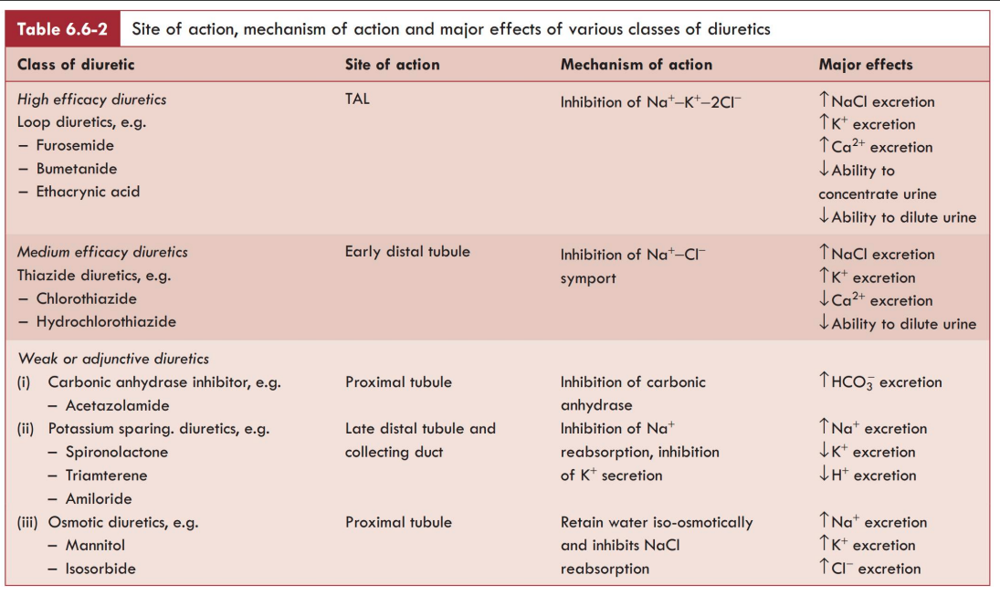

# DIURETICS

The diuretics are the drugs which primarily cause a net loss of $\text{Na}^+$ (*natriuresis*) associated with water loss (secondary to natriuresis) and thus increase the rate of urine flow.

---

### Classification

Depending upon their efficacy, the diuretic drugs can be classified as:

<ol>
  <li>
    <b><em>High-efficacy diuretics</em></b> (inhibitors of $\text{Na}^+\text{-}\text{K}^+\text{-}2\text{Cl}^-$ transport), also called loop diuretics, e.g. Furosemide.
  </li>
  <li>
    <b><em>Medium efficacy diuretics</em></b> (inhibitors of $\text{Na}^+\text{-}\text{Cl}^-$ symport)
    <ul>
      <li><b>(i)</b> Thiazide diuretics, e.g. chlorothiazide.</li>
    </ul>
  </li>
  <li>
    <b><em>Weak or adjunctive diuretics</em></b>
    <ul>
      <li><b>(i)</b> Carbonic anhydrase inhibitors, e.g. acetazolamide</li>
      <li><b>(ii)</b> Potassium sparing diuretics, e.g. spironolactone, triamterene and amiloride</li>
      <li><b>(iii)</b> Osmotic diuretics, e.g. mannitol, isosorbide and glycerol</li>
      <li><b>(iv)</b> Xanthines, e.g. theophylline.</li>
    </ul>
  </li>
</ol>

### Site of action, mechanism of action and major effects of various classes of diuretics

> 

<table>
  <thead>
    <tr>
      <th align="left">Class of diuretic</th>
      <th align="left">Site of action</th>
      <th align="left">Mechanism of action</th>
      <th align="left">Major effects</th>
    </tr>
  </thead>
  <tbody>
    <tr>
      <td>
        <em>High efficacy diuretics</em> 
        Loop diuretics, e.g.
        <ul>
          <li>Furosemide</li>
          <li>Bumetanide</li>
          <li>Ethacrynic acid</li>
        </ul>
      </td>
      <td>Thick ALOH (TAL)</td>
      <td>Inhibition of $\text{Na}^+\text{-}\text{K}^+\text{-}2\text{Cl}^-$</td>
      <td>
        $\uparrow \text{NaCl}$ excretion 
        $\uparrow \text{K}^+$ excretion 
        $\uparrow \text{Ca}^{2+}$ excretion 
        $\downarrow$ Ability to concentrate urine 
        $\downarrow$ Ability to dilute urine
      </td>
    </tr>
    <tr>
      <td>
        <em>Medium efficacy diuretics</em> 
        Thiazide diuretics, e.g.
        <ul>
          <li>Chlorothiazide</li>
          <li>Hydrochlorothiazide</li>
        </ul>
      </td>
      <td>Early distal tubule</td>
      <td>Inhibition of $\text{Na}^+\text{-}\text{Cl}^-$ symport</td>
      <td>
        $\uparrow \text{NaCl}$ excretion 
        $\uparrow \text{K}^+$ excretion 
        $\downarrow \text{Ca}^{2+}$ excretion 
        $\downarrow$ Ability to dilute urine
      </td>
    </tr>
    <tr>
      <td>
        <em>Weak or adjunctive diuretics</em>  
        <b>(i)</b> Carbonic anhydrase inhibitor, e.g.
        <ul>
          <li>Acetazolamide</li>
        </ul>
        <b>(ii)</b> Potassium sparing diuretics, e.g.
        <ul>
          <li>Spironolactone</li>
          <li>Triamterene</li>
          <li>Amiloride</li>
        </ul>
        <b>(iii)</b> Osmotic diuretics, e.g.
        <ul>
          <li>Mannitol</li>
          <li>Isosorbide</li>
        </ul>
      </td>
      <td>
         Proximal tubule    
        Late distal tubule and collecting duct     
        Proximal tubule
      </td>
      <td>
         Inhibition of carbonic anhydrase   
        Inhibition of $\text{Na}^+$ reabsorption, inhibition of $\text{K}^+$ secretion    
        Retain water iso-osmotically and inhibits $\text{NaCl}$ reabsorption
      </td>
      <td>
         $\uparrow \text{HCO}_3^-$ excretion    
        $\uparrow \text{Na}^+$ excretion 
        $\downarrow \text{K}^+$ excretion 
        $\downarrow \text{H}^+$ excretion   
        $\uparrow \text{Na}^+$ excretion 
        $\uparrow \text{K}^+$ excretion 
        $\uparrow \text{Cl}^-$ excretion
      </td>
    </tr>
  </tbody>
</table>

### Other substances which act as diuretics

<ul>
  <li><em>Water.</em> It acts by inhibiting antidiuretic hormone ($\text{ADH}$) secretion</li>
  <li><em>Alcohol.</em> It also acts by inhibiting $\text{ADH}$ secretion</li>
  <li><em>Antagonist of $\text{V}_2$ vasopressin inhibitors</em> inhibit action of vasopressin on the collecting ducts</li>
  <li><em>Glucose</em> (e.g. in diabetes mellitus). It acts as an osmotic diuretic</li>
  <li><em>Caffeine.</em> It increases $\text{GFR}$ and probably decreases renal tubular $\text{Na}^+$ reabsorption.</li>
</ul>