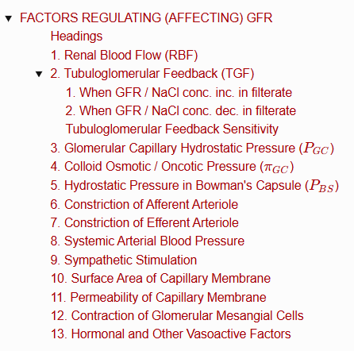
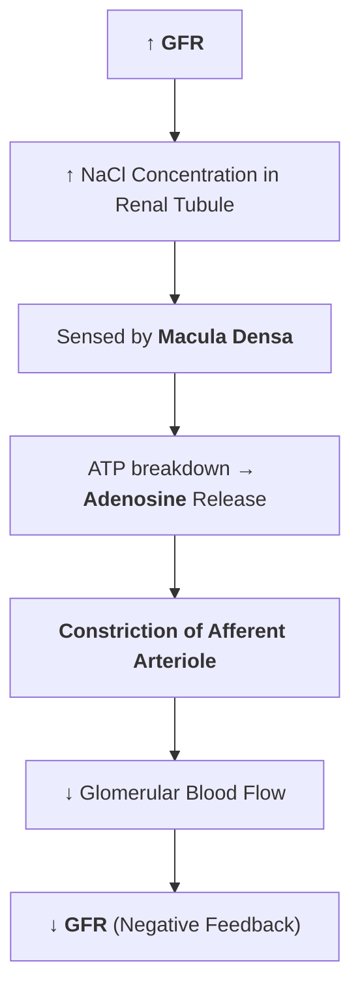
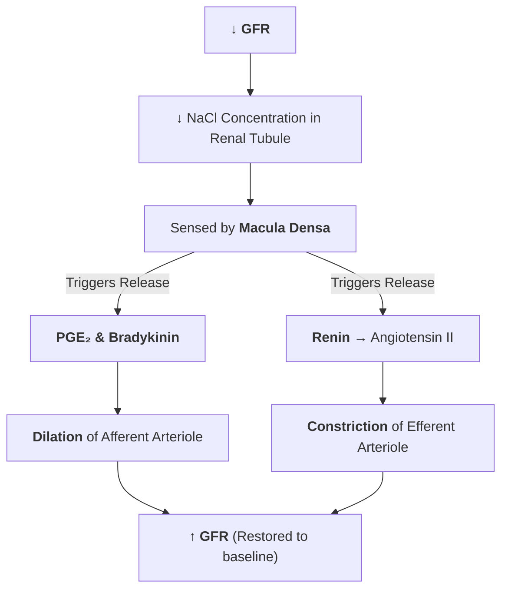
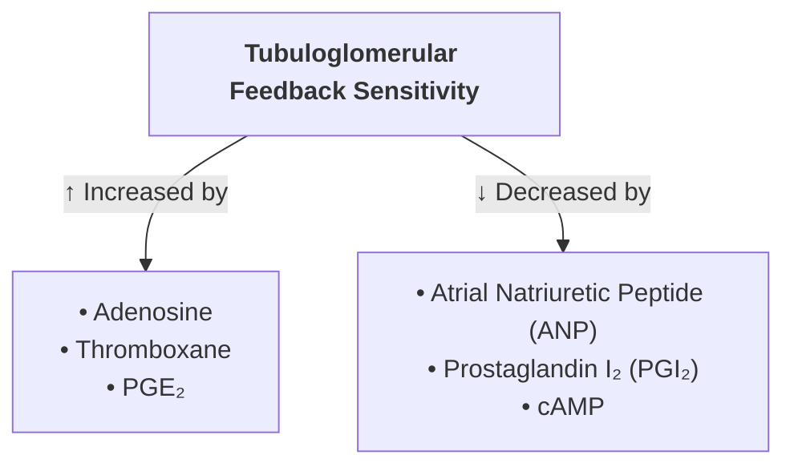

# FACTORS REGULATING (AFFECTING) GFR

> ### Headings
> 

---

### 1. Renal Blood Flow (RBF)
* **Relationship :** $\text{GFR} \propto \text{Renal Blood Flow}$.
* **Autoregulation :** Maintained relatively constant across mean arterial pressures of $80 - 180\text{ mmHg}$ via intrinsic renal autoregulatory mechanisms.

---

### 2. Tubuloglomerular Feedback (TGF)
* **Definition :** An intrinsic feedback mechanism that regulates GFR through the renal tubules, specifically mediated by the **macula densa**.
* **Mechanism :** The macula densa senses changes in **sodium chloride ($\text{NaCl}$) concentration** in the tubular filtrate of the distal tubule and adjusts afferent arteriolar resistance accordingly.

---

#### 1. When GFR / NaCl conc. inc. in filterate

$$\uparrow \text{ Increase in GFR}$$
$$\downarrow$$
$$\uparrow \text{ Increase in } \text{NaCl concentration in renal tubule}$$
$$\downarrow$$
$$\text{Sensed by } \mathbf{Macula \ Densa}$$
$$\downarrow$$
$$\text{Hydrolysis of ATP } (\text{ATP} \rightarrow 3\text{P}_i) \longrightarrow \uparrow \mathbf{Adenosine}$$
$$\downarrow$$
$$\mathbf{Constriction \ of \ Afferent \ Arteriole}$$
$$\downarrow$$
$$\downarrow \text{ Decrease in Glomerular Blood Flow}$$
$$\downarrow$$
$$\mathbf{\downarrow \text{ Decrease in GFR (Restored to baseline)}}$$

---

#### 2. When GFR / NaCl conc. dec. in filterate 

$$\downarrow \text{ Decrease in GFR}$$

$$\downarrow$$

$$\downarrow \text{ Decrease in } \text{NaCl concentration in renal tubule}$$

$$\downarrow$$

$$\text{Sensed by } \mathbf{Macula \ Densa}$$

$$\swarrow \qquad \qquad \searrow$$

$$\begin{gathered}
\text{Release of } \mathbf{PGE_2} \ \& \ \mathbf{Bradykinin} \\
\downarrow \\
\mathbf{Dilation \ of \ Afferent \ Arteriole}
\end{gathered}
\qquad\qquad
\begin{gathered}
\text{Release of } \mathbf{Renin} \\
\downarrow \\
\text{Angiotensinogen} \rightarrow \mathbf{Angiotensin \ II} \\
\downarrow \\
\mathbf{Constriction \ of \ Efferent \ Arteriole}
\end{gathered}$$

$$\searrow \qquad \qquad \swarrow$$

$$\mathbf{\uparrow \text{ Increase in GFR (Restored to baseline)}}$$

#### Tubuloglomerular Feedback Sensitivity

---

### 3. Glomerular Capillary Hydrostatic Pressure ($P_{GC}$)

* **Relationship :** $\text{GFR} \propto \text{Glomerular Capillary Pressure}$.
* **Normal Value :** **$60\text{ mmHg}$**.
* **Determinants :** Depends directly on **Renal Blood Flow** and **Systemic Arterial Blood Pressure**.

---

### 4. Colloid Osmotic / Oncotic Pressure ($\pi_{GC}$)

* **Relationship :** $\text{GFR} \propto \dfrac{1}{\text{Colloid Osmotic Pressure}}$ *(Inversely proportional)*.
* **Normal Value :** **$25\text{ mmHg}$**.
* **Variations :—**
* $\uparrow$ **Increased in :** Dehydration (concentrates plasma proteins $\longrightarrow \downarrow$ decreases GFR).
* $\downarrow$ **Decreased in :** Hypoproteinemia (dilutes/lowers plasma protein concentration $\longrightarrow \uparrow$ increases GFR).

---

### 5. Hydrostatic Pressure in Bowman's Capsule ($P_{BS}$)

* **Relationship :** $\text{GFR} \propto \dfrac{1}{\text{Hydrostatic Pressure in Bowman's Capsule}}$ *(Inversely proportional)*.
* **$\uparrow$ Increased in Pathological Conditions :—**
* Obstruction in the urinary tract (e.g., urethral/ureteral calculi or strictures).
* Edema of the kidney beneath the non-distensible renal capsule.
* *(Elevated back-pressure directly opposes filtration $\longrightarrow \downarrow$ decreases GFR)*.

---

### 6. Constriction of Afferent Arteriole

$$\text{Constriction of Afferent Arteriole}$$
$$\downarrow$$
$$\downarrow \text{ Decrease in Glomerular Capillaries Blood Flow}$$
$$\downarrow$$
$$\mathbf{\downarrow \text{ Decrease in GFR}}$$

---

### 7. Constriction of Efferent Arteriole

$$\text{Constriction of Efferent Arteriole}$$
$$\swarrow \qquad\qquad \searrow$$
$$\begin{gathered}
\textbf{Moderate / Initial Constriction} \\
\downarrow \\
\mathbf{\uparrow \text{ Increases GFR}} \\
\text{(Due to blood stagnation \& } \uparrow \text{ hydrostatic pressure} \\
\text{in glomerular capillaries)}
\end{gathered}
\qquad\qquad
\begin{gathered}
\textbf{Severe / Prolonged Constriction} \\
\downarrow \\
\mathbf{\text{No filtration occurs (No GFR or } \downarrow \text{ GFR)}} \\
\text{(Due to severe blockage } \rightarrow \text{ no forward} \\
\text{blood flow through the capillaries)}
\end{gathered}$$

---

### 8. Systemic Arterial Blood Pressure

* **Autoregulation :** Renal Blood Flow (RBF) and GFR remain relatively **unaffected** as long as the Mean Arterial Blood Pressure stays within the normal autoregulatory range:
  $$\mathbf{60 - 180\text{ mmHg}}$$
* **Mechanism :** Regulated intrinsically by renal vascular autoregulation (myogenic mechanism and tubuloglomerular feedback).

---

### 9. Sympathetic Stimulation

* **Moderate Stimulation :** Produces **no significant change in GFR**.
* **Strong Stimulation :**
  $$\text{Strong Sympathetic Stimulation}$$
  $$\downarrow$$
  $$\text{Severe constriction of Efferent arteriole } > \text{ Afferent arteriole}$$
  $$\swarrow \qquad\qquad \searrow$$
  $$\begin{gathered}
  \textbf{Initial Phase} \\
  \downarrow \\
  \mathbf{\uparrow \text{ Increases GFR}}
  \end{gathered}
  \qquad\qquad
  \begin{gathered}
  \textbf{Late / Sustained Phase} \\
  \downarrow \\
  \mathbf{\downarrow \text{ Decreases GFR}}
  \end{gathered}$$

---

### 10. Surface Area of Capillary Membrane

* **Relationship :**
  $$\text{GFR} \propto \text{Surface Area of Glomerular Capillary Membrane}$$
* $\uparrow$ Larger surface area increases GFR; $\downarrow$ reduced filtration surface area decreases GFR.

---

### 11. Permeability of Capillary Membrane

* **Relationship :**
  $$\text{GFR} \propto \text{Permeability of Capillary Membrane}$$
* $\uparrow$ Greater membrane pore permeability increases filtration rate.

---

### 12. Contraction of Glomerular Mesangial Cells

$$\text{Contraction of Mesangial Cells}$$
$$\downarrow$$
$$\downarrow \text{ Decreases effective surface area of glomerular capillaries}$$
$$\downarrow$$
$$\mathbf{\downarrow \text{ Decreases GFR}}$$

---

### 13. Hormonal and Other Vasoactive Factors

<table>
  <thead>
    <tr>
      <th align="left">Factors that $\uparrow$ Increase GFR <i>(via Vasodilation)</i></th>
      <th align="left">Factors that $\downarrow$ Decrease GFR <i>(via Vasoconstriction)</i></th>
    </tr>
  </thead>
  <tbody>
    <tr>
      <td>
        • <b>Atrial Natriuretic Peptide (ANP)</b> 
        • <b>Brain Natriuretic Peptide (BNP)</b> 
        • <b>Cyclic AMP (cAMP)</b> 
        • <b>Dopamine</b> 
        • <b>Prostaglandin $\text{E}_2$ ($\text{PGE}_2$)</b>
      </td>
      <td>
        • <b>Angiotensin II</b> 
        • <b>Endothelins</b> 
        • <b>Noradrenaline (Norepinephrine)</b> 
        • <b>Platelet-Activating Factor (PAF)</b> 
        • <b>Prostaglandin $\text{F}_2$ ($\text{PGF}_2$)</b>
      </td>
    </tr>
  </tbody>
</table>
