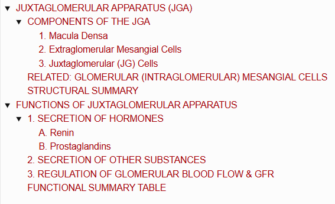
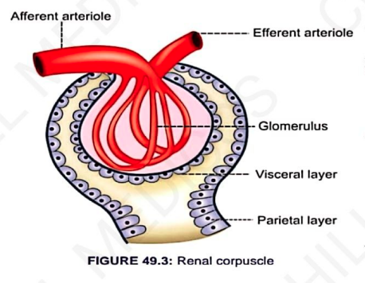
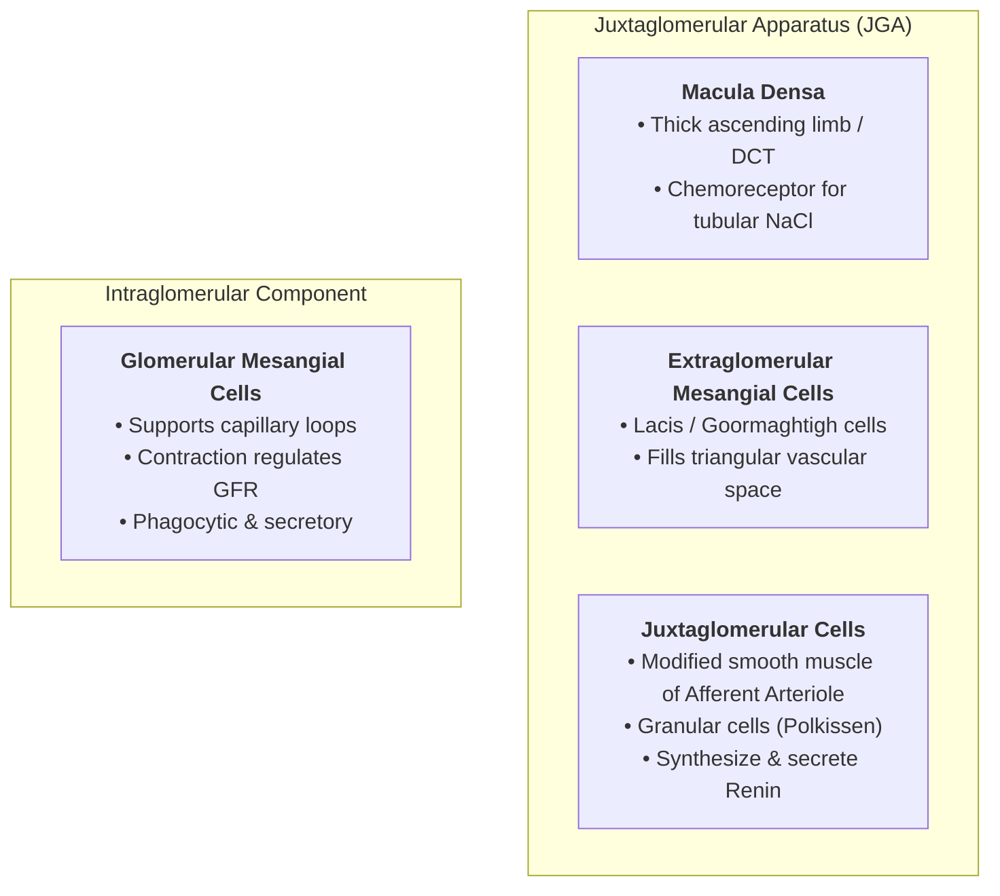

# JUXTAGLOMERULAR APPARATUS (JGA)

> ### Headings
> 

* **Definition :** A specialized microscopic structure situated near the glomerulus of each nephron (*Juxta = near*).
* **Components :** Formed by **3 principal cellular elements**:
  * 1. Macula Densa
  * 2. Extraglomerular Mesangial Cells
  * 3. Juxtaglomerular (JG) Cells

---

## COMPONENTS OF THE JGA

### 1. Macula Densa
* **Location :** Located in the terminal portion of the **thick ascending limb of the loop of Henle** just before it opens into the distal convoluted tubule (DCT).
* **Position :** Lies in the acute angle between the **afferent and efferent arterioles** of the same nephron (in very close contact with the afferent arteriole).
* **Structure :** Formed by **tightly packed, specialized cuboidal/columnar epithelial cells** that act as chemoreceptors sensing $\text{NaCl}$ concentration in tubular fluid.

---

### 2. Extraglomerular Mesangial Cells
* **Location :** Situated within the **triangular region** bounded by the macula densa, afferent arteriole, and efferent arteriole.
* **Synonyms :**
  * • Agranular cells
  * • Lacis cells
  * • Goormaghtigh cells

---

### 3. Juxtaglomerular (JG) Cells
* **Definition :** Specialized, modified vascular **smooth muscle cells** located primarily in the wall of the **afferent arteriole** just before it enters Bowman's capsule.
* **Location in Vessel Wall :** Present predominantly within the **tunica media** and **tunica adventitia** of the afferent arteriole.
* **Synonyms & Characteristics :**
  * Also called **Granular cells** because their cytoplasm contains prominent secretory granules storing **renin**.
  * Aggregation of these cells forms the **polar cushion / Polkissen**.

---

## RELATED: GLOMERULAR (INTRAGLOMERULAR) MESANGIAL CELLS

* **Location :** Situated within the glomerular tuft between the **capillary loops**.
* **Key Functions :—**
  * **Structural Support :** Provide architectural support for the glomerular capillary loops.
  * **Regulation of GFR :** Exhibit **contractile properties**; contraction decreases the effective capillary surface area, thereby reducing GFR.
  * **Phagocytic Activity :** Phagocytose trapped immune complexes and debris to keep the filtration barrier clear.
  * **Secretory Function :** Synthesize and secrete:
    * • Glomerular interstitial matrix (mesangial matrix)
    * • Prostaglandins
    * • Cytokines

---

## STRUCTURAL SUMMARY

> 

---
---

# FUNCTIONS OF JUXTAGLOMERULAR APPARATUS

---

## 1. SECRETION OF HORMONES

The Juxtaglomerular (JG) apparatus secretes **2 principal hormones**:
* 1. **Renin**
* 2. **Prostaglandins**

---

### A. Renin
* **Site of Secretion :** Secreted by **Juxtaglomerular (JG) cells** *(granular cells of the afferent arteriole)*.
* **Nature :** Peptide composed of **340 amino acids**.
* **Physiological Role :** Forms the **Renin-Angiotensin System (RAS)** in conjunction with angiotensins for the regulation and maintenance of systemic blood pressure (BP).
* **Stimuli for Renin Secretion :—**
  * 1. Fall in arterial blood pressure.
  * 2. $\downarrow$ Decrease in Extracellular Fluid (ECF) volume.
  * 3. $\uparrow$ Increased sympathetic nerve activity.
  * 4. $\downarrow$ Decreased tubular load of sodium ($\text{Na}^+$) and chloride ($\text{Cl}^-$) reaching the macula densa.

---

### B. Prostaglandins
* **Site of Secretion :** Secreted by **Extraglomerular mesangial cells** *(Lacis / Goormaghtigh cells)*.
* *(Note: Medullary interstitial cells [Type-I interstitial cells / MIC] also secrete prostaglandins).*

---

## 2. SECRETION OF OTHER SUBSTANCES

* **Extraglomerular Mesangial Cells :** Secrete vital **cytokines**, including:
  * • **Interleukin-2 (IL-2)**
  * • **Tumor Necrosis Factor (TNF)**
* **Macula Densa :** Synthesizes and secretes **Thromboxane $\text{A}_2$ ($\text{TXA}_2$)**.

---

## 3. REGULATION OF GLOMERULAR BLOOD FLOW & GFR

$$\text{Macula Densa senses luminal } \text{NaCl} \text{ delivery}$$
$$\downarrow$$
$$\text{Activates } \mathbf{Tubuloglomerular \ Feedback \ (TGF)} \text{ mechanism}$$
$$\downarrow$$
$$\mathbf{\text{Regulates Glomerular Blood Flow (GBF) \& Glomerular Filtration Rate (GFR)}}$$

---

## FUNCTIONAL SUMMARY TABLE

<table>
  <thead>
    <tr>
      <th align="left">Cellular Component</th>
      <th align="left">Secretory Products / Mediators</th>
      <th align="left">Primary Physiological Role</th>
    </tr>
  </thead>
  <tbody>
    <tr>
      <td><b>Juxtaglomerular Cells</b></td>
      <td><b>Renin</b> (340 AA peptide)</td>
      <td>Initiates the RAS cascade to maintain systemic arterial pressure and fluid balance.</td>
    </tr>
    <tr>
      <td><b>Extraglomerular Mesangial Cells</b></td>
      <td>
        • <b>Prostaglandins</b> 
        • <b>Cytokines</b> (IL-2, TNF)
      </td>
      <td>Local vascular autoregulation and paracrine immune/inflammatory mediation.</td>
    </tr>
    <tr>
      <td><b>Macula Densa</b></td>
      <td>• <b>Thromboxane $\text{A}_2$</b></td>
      <td>Acts as the chemosensory hub for <b>Tubuloglomerular Feedback</b>, adjusting GFR and GBF.</td>
    </tr>
  </tbody>
</table>

