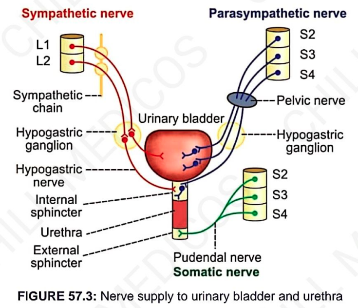
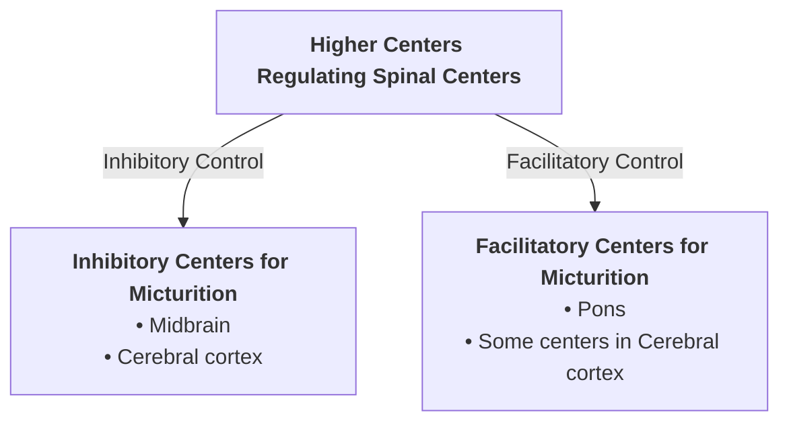

# MICTURITION REFLEX

* **Trigger / Elicitation :** Elicited by the stimulation of **stretch receptors** located in the wall of the **urinary bladder** and **urethra**.
* **Initiation Pathway :**
  $$300 - 400\text{ mL of urine is collected in the bladder}$$
  $$\downarrow$$
  $$\uparrow \text{ Intravesical pressure increases}$$
  $$\downarrow$$
  $$\text{Stretched bladder wall}$$
  $$\downarrow$$
  $$\text{Stimulation of stretch receptors}$$
  $$\downarrow$$
  $$\mathbf{\text{Generation of nerve impulse}}$$

# PATHWAY OF MICTURITION REFLEX

> 

$$\text{Filling of urinary bladder}$$
$$\downarrow$$
$$\text{Stimulation of stretch receptors}$$
$$\downarrow$$
$$\text{Afferent impulses pass via } \mathbf{pelvic\ nerve}$$
$$\downarrow$$
$$\mathbf{Sacral\ segment\ of\ spinal\ cord}$$
$$\downarrow$$
$$\text{Efferent impulses pass via } \mathbf{pelvic\ nerve}$$
$$\downarrow$$
$$\mathbf{Contraction\ of\ detrusor\ muscle} \ \& \ \mathbf{Relaxation\ of\ internal\ sphincter}$$
$$\downarrow$$
$$\text{Flow of urine into urethra and stimulation of stretch receptors}$$
$$\downarrow$$
$$\text{Afferent impulses pass via } \mathbf{pelvic\ nerve}$$
$$\downarrow$$
$$\mathbf{Inhibition\ of\ pudendal\ nerve}$$
$$\downarrow$$
$$\mathbf{Relaxation\ of\ external\ sphincter}$$
$$\downarrow$$
$$\mathbf{Voiding\ of\ urine}$$

---

### Key Feature: Self-Regenerative Nature
* Once the micturition reflex begins, it is **self-regenerative**.
* Initial contraction of the bladder further activates the stretch receptors.
* This still further **$\uparrow$ increases the sensory impulses** from the bladder and urethra.
* The cycle continues until the force of contraction of the bladder reaches its maximum.
* **Complete Voiding :** The urine is voided out completely.
* **Abdominal Pressure :** During micturition, the flow of urine is facilitated by **$\uparrow$ increased intra-abdominal pressure**.

---

## HIGHER CENTERS FOR MICTURITION

* **Spinal Centers :**
  * Sacral region
  * Lumbar segment
* Spinal centers are **regulated by higher centers**:

---

## APPLIED PHYSIOLOGY

* **1. Atonic Bladder :** Due to **destruction of sensory nerve fibers** (loss of afferent stretch reflex).
* **2. Automatic Bladder :** Characterized by a **hyperactive micturition reflex** (loss of inhibitory control from higher centers).
* **3. Nocturnal Micturition :** **Involuntary voiding of urine** during the night.

