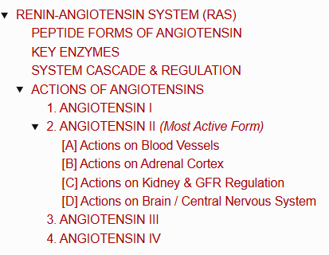
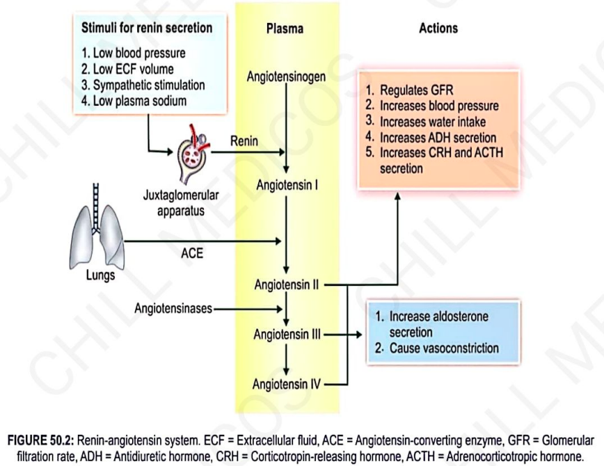
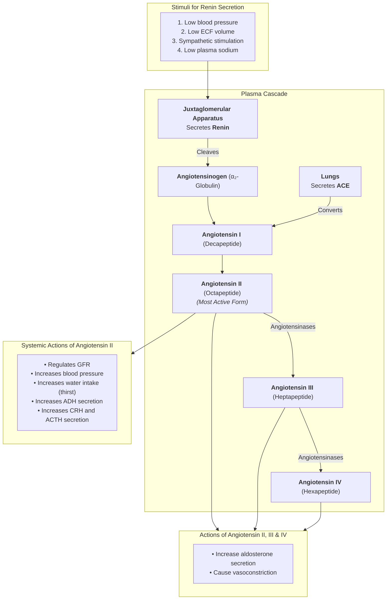
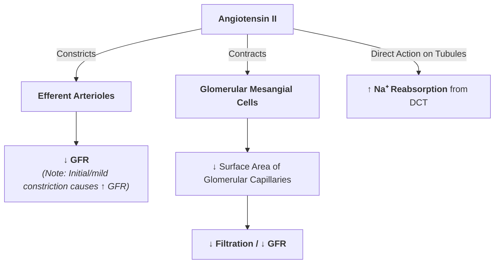

# RENIN-ANGIOTENSIN SYSTEM (RAS)

> ### Headings
> 

* **Primary Substrate :** $\mathbf{\alpha_2\text{-Globulin}}$ (**Angiotensinogen**), synthesized mainly by the liver, serves as the primary substrate for the enzyme **renin** (secreted by the juxtaglomerular apparatus of the kidneys).

---

## PEPTIDE FORMS OF ANGIOTENSIN

<table>
  <thead>
    <tr>
      <th align="left">Peptide Form</th>
      <th align="center">Chain Length</th>
      <th align="left">Biological Activity & Key Properties</th>
    </tr>
  </thead>
  <tbody>
    <tr>
      <td><b>Angiotensin I</b></td>
      <td align="center">Decapeptide (10 aa)</td>
      <td>• <b>Physiologically inactive</b>; serves solely as an intermediate precursor.</td>
    </tr>
    <tr>
      <td><b>Angiotensin II</b></td>
      <td align="center">Octapeptide (8 aa)</td>
      <td>
        • <b>Most active form</b> of the system. 
        • Very short half-life: <b>$1 - 2\text{ minutes}$</b>.
      </td>
    </tr>
    <tr>
      <td><b>Angiotensin III</b></td>
      <td align="center">Heptapeptide (7 aa)</td>
      <td>• Active derivative; stimulates aldosterone secretion and causes vasoconstriction.</td>
    </tr>
    <tr>
      <td><b>Angiotensin IV</b></td>
      <td align="center">Hexapeptide (6 aa)</td>
      <td>• Further cleavage product; possesses moderate biological activity.</td>
    </tr>
  </tbody>
</table>

---

## KEY ENZYMES

1. **Angiotensin-Converting Enzyme (ACE) :**
  $$\text{Angiotensin I} \xrightarrow{\mathbf{ACE}} \text{Angiotensin II}$$
     * Secreted predominantly by vascular endothelial cells of the **lungs** (and renal capillaries).

1. **Angiotensinases :**
  $$\text{Angiotensin II} \xrightarrow{\mathbf{Angiotensinases}} \text{Angiotensin III} \longrightarrow \text{Angiotensin IV}$$
     * Present in **RBCs** and the **vascular beds** of many peripheral tissues.

---

## SYSTEM CASCADE & REGULATION

> 

---

## ACTIONS OF ANGIOTENSINS

---

### 1. ANGIOTENSIN I
* **Physiologically Inactive :** Serves only as a precursor molecule for Angiotensin II.

---

### 2. ANGIOTENSIN II *(Most Active Form)*

#### [A] Actions on Blood Vessels
* **Direct Vasoconstriction :** Potent direct arteriolar vasoconstrictor $\longrightarrow \uparrow$ increases total peripheral resistance and **$\uparrow$ raises Blood Pressure (BP)** *(hypertensin action)*.
* **Indirect BP Increase :** Stimulates the release of **noradrenaline** (a potent vasoconstrictor) from postganglionic sympathetic nerve fibers.

---

#### [B] Actions on Adrenal Cortex
* Stimulates the **Zona Glomerulosa** cells of the adrenal cortex to secrete **Aldosterone**.
* Aldosterone acts on the **Distal Convoluted Tubules (DCT)** of kidneys $\longrightarrow \uparrow$ increases $\text{Na}^+$ retention (and secondary water retention) $\longrightarrow \mathbf{\uparrow \text{ Blood Pressure}}$.

---

#### [C] Actions on Kidney & GFR Regulation

---

#### [D] Actions on Brain / Central Nervous System

* **Inhibits Baroreceptor Reflex :** Blunts the reflex response that normally opposes elevations in BP, thereby sustaining hypertension.
* **Stimulates Thirst Center :** $\uparrow$ Increases water intake (dipsogenic effect).
* **$\uparrow$ Increases CRH Secretion :** Acts on the hypothalamus to release Corticotropin-Releasing Hormone (CRH) $\longrightarrow \uparrow$ stimulates **ACTH secretion** from the anterior pituitary.
* **$\uparrow$ Increases ADH Secretion :** Stimulates the hypothalamus to release **Antidiuretic Hormone (ADH / Vasopressin)**, promoting renal water reabsorption.

---

### 3. ANGIOTENSIN III

* **$\uparrow$ Increases Blood Pressure**.
* **Potency Profile :**
* **$100\%$ adrenocortical stimulating activity** compared to Angiotensin II (equally potent at stimulating aldosterone release).
* **$40\%$ vasopressor (vasoconstrictor) activity** of Angiotensin II.

---

### 4. ANGIOTENSIN IV

* Possesses moderate **adrenocortical stimulating** and **vasopressor activities**.

---
