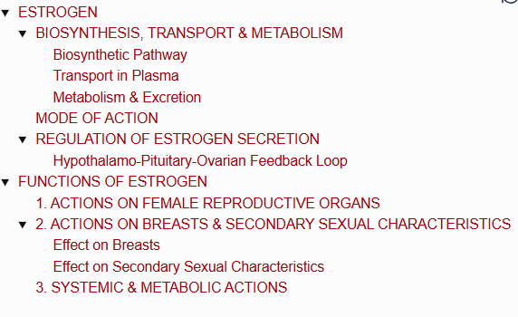
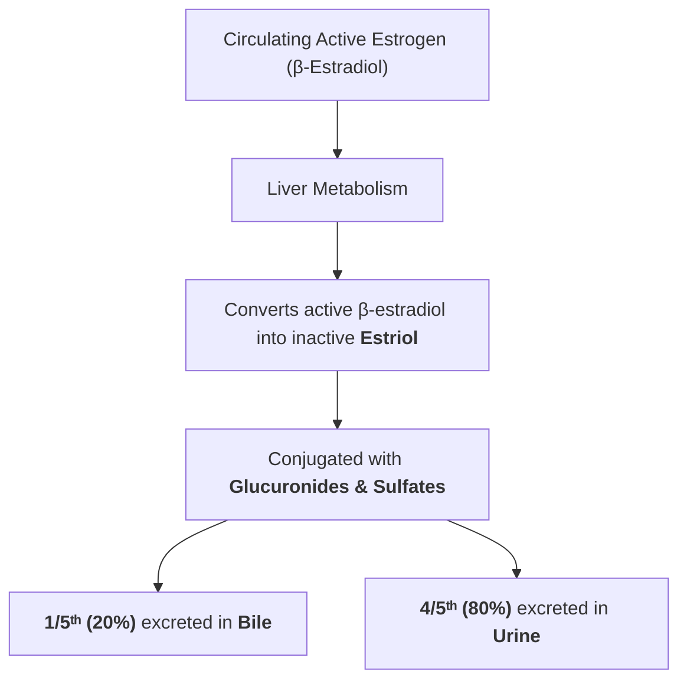
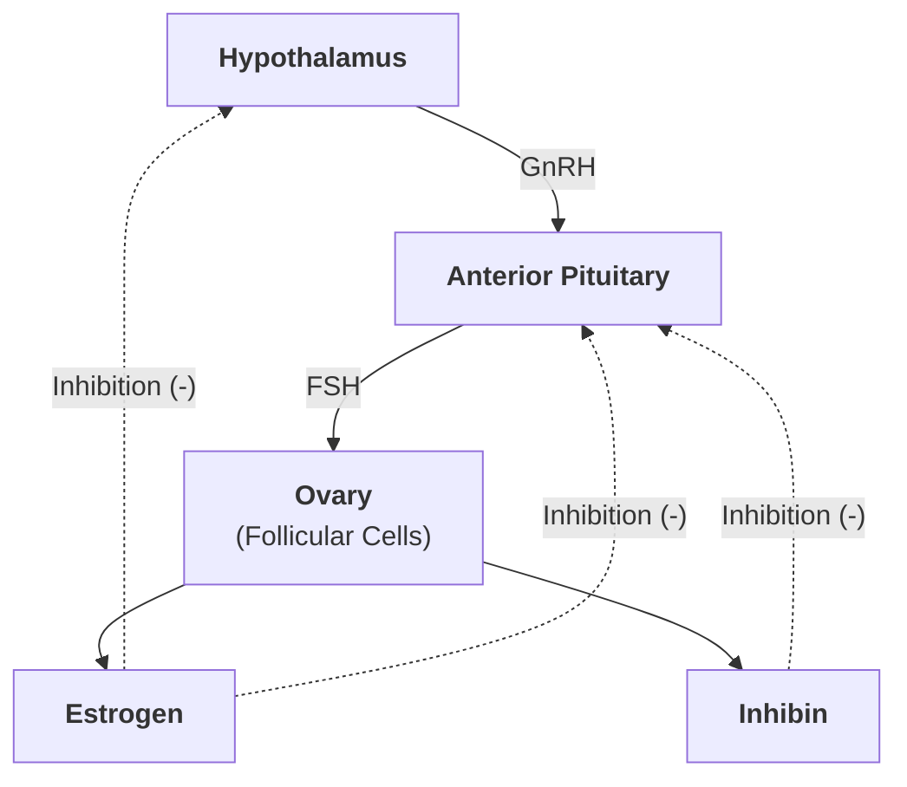
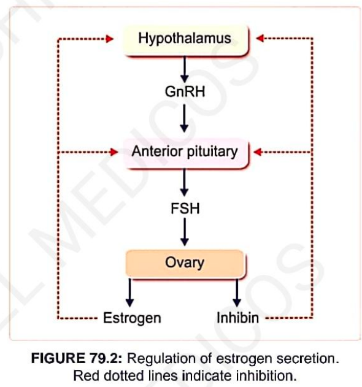

# ESTROGEN

> ### Headings
> 

* **Source of Secretion :—**
  * **In Non-Pregnant Woman :** Secreted by the **theca interna cells** and **granulosa cells** of ovarian follicles.
    * Secretion is predominant in the **follicular phase** before ovulation.
    * Estrogen is synthesized from androgens, particularly **androstenedione** produced by theca interna cells:
      $$\text{Androstenedione (in Granulosa Cells)} \xrightarrow{\text{Aromatase}} \text{Estrogen}$$
  * **In Pregnant Woman :** Secreted by the **placenta**.

* **Chemistry :** $\text{C}_{18}$ steroid hormone.
* **Different Forms in Plasma :—**
  * 1. **$\beta$-Estradiol** *(Major and most potent form)*
  * 2. **Estrone**
  * 3. **Estriol** *(Weak / inactive form)*

* **Plasma Levels :—**
  * **In Females (Follicular Phase) :** $30 - 200\text{ pg/mL}$
  * **In Adult Males :** $12 - 34\text{ pg/mL}$
* **Half-Life :** $30 - 60\text{ minutes}$.

---

## BIOSYNTHESIS, TRANSPORT & METABOLISM

### Biosynthetic Pathway

$$\text{Acetate} \longrightarrow \text{Cholesterol} \longrightarrow \text{Pregnenolone} \longrightarrow \text{Progesterone} \longrightarrow \text{Testosterone} \longrightarrow \mathbf{Estrogen}$$

---

### Transport in Plasma
* Transported bound to **plasma albumin** (primary carrier) and in smaller quantities bound to **sex hormone-binding globulin (SHBG)**.

---

### Metabolism & Excretion

---

## MODE OF ACTION

* **Receptor Location :** Estrogen receptors ($\text{ER}$) are located primarily on the **nuclear membrane / nucleus** of target cells.
* **Receptor Subtypes & Distribution :—**

---

## REGULATION OF ESTROGEN SECRETION

* Regulated predominantly by **Follicle-Stimulating Hormone (FSH)** released from the anterior pituitary.
* **Second Messenger Mechanism :**

$$\text{FSH binds to membrane receptors on Theca \& Granulosa cells}$$

$$\downarrow$$

$$\text{Activates intracellular } \mathbf{cAMP} \text{ second messenger system}$$

$$\downarrow$$

$$\text{Stimulates secretory and aromatase enzymatic activities } \longrightarrow \uparrow \mathbf{Estrogen \ Synthesis}$$

---

### Hypothalamo-Pituitary-Ovarian Feedback Loop

> 

# FUNCTIONS OF ESTROGEN

* **Primary Role :** Promotes **cellular proliferation and tissue growth** in sexual organs and other tissues related to reproduction.

---

## 1. ACTIONS ON FEMALE REPRODUCTIVE ORGANS

<table>
  <thead>
    <tr>
      <th align="left">Target Organ</th>
      <th align="left">Physiological Actions & Morphological Changes</th>
    </tr>
  </thead>
  <tbody>
    <tr>
      <td><b>1. Ovarian Follicles</b></td>
      <td>
        • Promotes growth and maturation of ovarian follicles by stimulating the proliferation of follicular (granulosa) cells. 
        • $\uparrow$ Increases the secretory activity of theca cells.
      </td>
    </tr>
    <tr>
      <td><b>2. Uterus</b></td>
      <td>
        • <b>Size:</b> Enlarges the uterus to about double its original size via cellular proliferation. 
        • <b>Endometrium:</b> $\uparrow$ Increases blood supply; stimulates proliferation and dilation of spiral vessels; promotes deposition of glycogen and lipids. 
        • <b>Myometrium:</b> $\uparrow$ Increases spontaneous excitability and contractility of uterine smooth muscle; $\uparrow$ increases sensitivity to <b>oxytocin</b>.
      </td>
    </tr>
    <tr>
      <td><b>3. Fallopian Tubes</b></td>
      <td>
        • Acts on the mucosal lining $\longrightarrow \uparrow$ increases the number and size of epithelial cells (ciliated cells). 
        • $\uparrow$ Increases <b>ciliary activity and beat frequency</b> to facilitate the transport of the ovum towards the uterus. 
        • Enhances proliferation of secretory/glandular cells.
      </td>
    </tr>
    <tr>
      <td><b>4. Vagina</b></td>
      <td>
        • Transforms vaginal epithelium from delicate <b>cuboidal to stratified squamous epithelium</b> (making it more resistant to trauma and infection). 
        • $\uparrow$ Increases epithelial cell layers through rapid proliferation. 
        • $\downarrow$ <b>Reduces vaginal pH</b> (increases acidity via lactic acid production from glycogen), protecting against common vaginal infections such as <i>gonorrheal vaginitis</i>.
      </td>
    </tr>
  </tbody>
</table>

---

## 2. ACTIONS ON BREASTS & SECONDARY SEXUAL CHARACTERISTICS

### Effect on Breasts
* Promotes development of stromal connective tissues of the breasts.
* Drives the growth of an **extensive ductile system**.
* Promotes adipose tissue deposition in the ductile framework.
* Stimulates the development of lobules and alveoli to some extent.

---

### Effect on Secondary Sexual Characteristics

<table>
  <thead>
    <tr>
      <th align="left">Feature / System</th>
      <th align="left">Characteristic Changes</th>
    </tr>
  </thead>
  <tbody>
    <tr>
      <td><b>Hair Distribution</b></td>
      <td>
        • Hair develops in the pubic and axillary regions. 
        • Pubic hair pattern has the <b>base of the triangle pointing upwards</b> (horizontal upper border). 
        • Scalp hair grows profusely.
      </td>
    </tr>
    <tr>
      <td><b>Skin</b></td>
      <td>Becomes soft, smooth, and warm ($\uparrow$ increased cutaneous vascularity).</td>
    </tr>
    <tr>
      <td><b>Body Shape</b></td>
      <td>Shoulders become narrower, hips broaden, thighs converge, and arms diverge (feminine contour).</td>
    </tr>
    <tr>
      <td><b>Pelvis</b></td>
      <td>
        • Broadening of the pelvis ($\uparrow$ increased transverse diameter). 
        • Assumes a <b>round / oval shape</b>. 
        • Pelvic outlet becomes round/oval-shaped to facilitate childbearing.
      </td>
    </tr>
    <tr>
      <td><b>Voice</b></td>
      <td>Retains a characteristic <b>high-pitch voice</b>.</td>
    </tr>
  </tbody>
</table>

---

## 3. SYSTEMIC & METABOLIC ACTIONS

* **Effect on Bones :—**
  * $\uparrow$ Increases **osteoblastic activity** and bone matrix formation.
  * Causes **early fusion of the epiphyses** with the shaft of long bones.
  * **Clinical Correlation (Osteoporosis):** In postmenopausal women / old age, estrogen secretion becomes deficient $\longrightarrow$ bones become extremely porous, fragile, and highly susceptible to fractures (**Osteoporosis**).

* **Effect on Metabolism :—**
  * **Protein Metabolism:** Exerts a mild protein anabolic effect ($\uparrow$ increases total body protein).
  * **Fat Metabolism:** Stimulates deposition of fat in subcutaneous tissues, especially in **breasts, buttocks, and thighs**.

* **Effect on Electrolyte & Fluid Balance :—**
  * Promotes **$\text{Na}^+$ and $\text{H}_2\text{O}$ retention** by renal tubules, causing mild fluid retention during high estrogen states.

