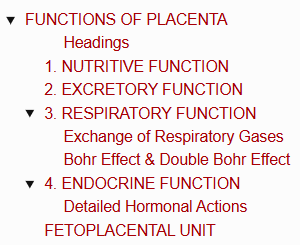
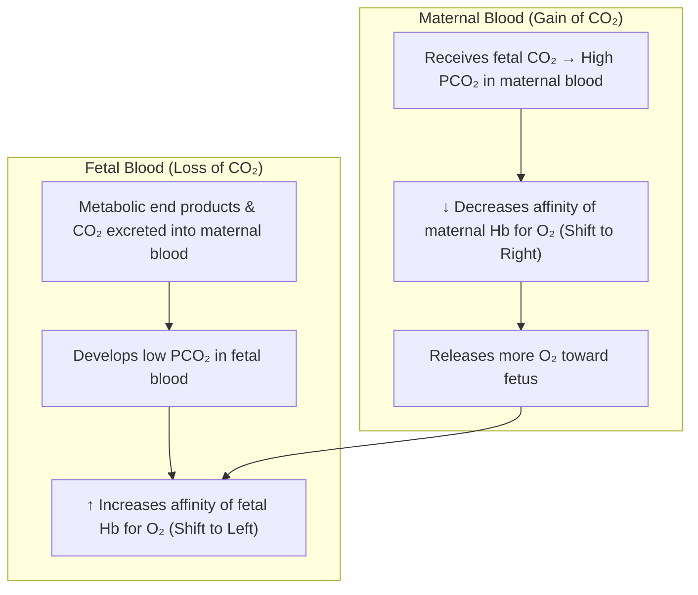
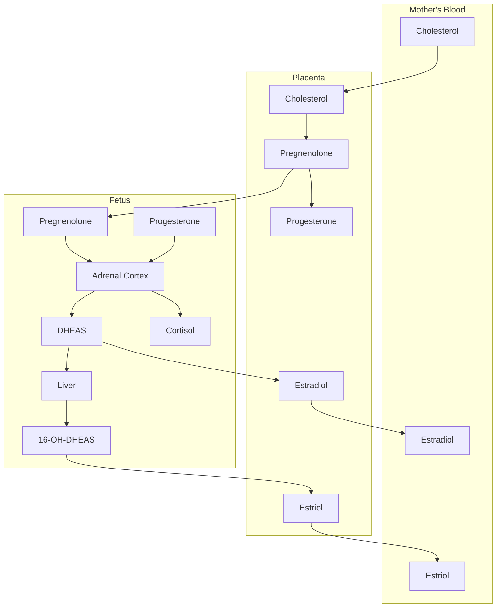
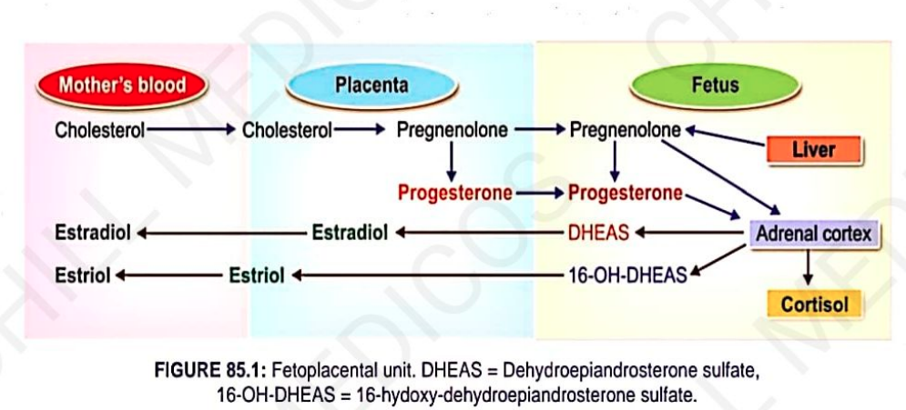

# FUNCTIONS OF PLACENTA

> ### Headings
> 

* **Placenta :** A temporary membranous vascular organ that develops in females during pregnancy.
* **Key Functions :—**
  * 1. Nutritive function
  * 2. Excretory function
  * 3. Respiratory function
  * 4. Endocrine function

---

## 1. NUTRITIVE FUNCTION

$$\text{Nutritive substances, electrolytes, and hormones necessary for fetal development}$$
$$\downarrow$$
$$\text{Diffuse directly from mother's blood across the placental barrier into fetal blood}$$

---

## 2. EXCRETORY FUNCTION

$$\text{Metabolic end products and other waste products from the fetal body}$$
$$\downarrow$$
$$\text{Excreted into maternal blood for elimination via maternal kidneys}$$

---

## 3. RESPIRATORY FUNCTION

* Fetal lungs are **non-functioning**; the placenta serves as the respiratory organ for the fetus.
* Necessary $\text{O}_2$ is received by diffusion from maternal blood.

---

### Exchange of Respiratory Gases

* Occurs via a **partial pressure gradient**:
  * $\text{P}\text{O}_2$ in maternal blood = **$50\text{ mmHg}$**
  * $\text{P}\text{O}_2$ in fetal blood = **$30\text{ mmHg}$**
  * **Pressure gradient of $20\text{ mmHg}$** drives the diffusion of $\text{O}_2$ into fetal circulation.

* **Adequate Oxygen Delivery Factors :—**
  * a. **Fetal Hemoglobin ($\text{HbF}$):** Has **$20\text{ times higher affinity}$** for oxygen than adult hemoglobin ($\text{HbA}$).
  * b. **Hemoglobin Concentration:** Approximately **$50\%\text{ higher}$** in fetal blood compared to adult blood.

---

### Bohr Effect & Double Bohr Effect

$$\textbf{Bohr Effect: } \downarrow \text{Decrease in Hb affinity for } \text{O}_2 \text{ due to } \uparrow \text{increased } \text{CO}_2 \text{ tension (acidosis)}$$

> **Double Bohr Effect :** The simultaneous operation of the Bohr effect in both fetal blood (left shift) and maternal blood (right shift), maximizing oxygen transfer across the placenta.

---

## 4. ENDOCRINE FUNCTION

The placenta secretes **5 major hormones**:

* 1. **Human Chorionic Gonadotropin (hCG)**

* 2. **Estrogen**

* 3. **Progesterone**

* 4. **Human Chorionic Somatomammotropin (HCS / Placental Lactogen)**

* 5. **Relaxin**

---

### Detailed Hormonal Actions

---

## FETOPLACENTAL UNIT

* **Definition :** Functional cooperation and metabolic interaction between the **fetus** and the **placenta** in the synthesis of steroid hormones.
* **Reason for Interaction :** Some key steroidogenic enzymes are present only in the fetus and absent in the placenta, and vice versa.

> 