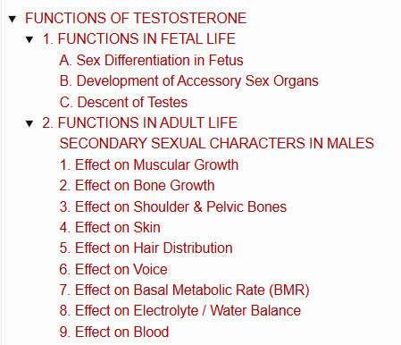
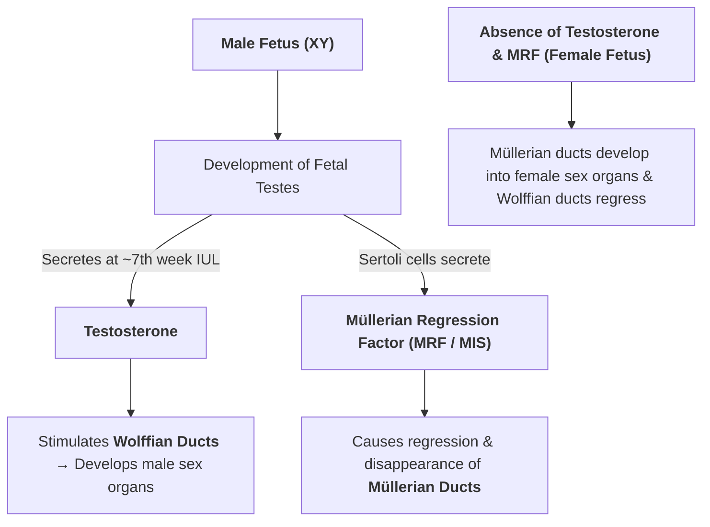

# FUNCTIONS OF TESTOSTERONE

> ### Headings
> 

* Responsible for the **distinguishing characteristics of the masculine body**.
* Actions are divided into:
  * 1. Functions in fetal life
  * 2. Functions in adult life

---

## 1. FUNCTIONS IN FETAL LIFE

Testosterone performs **3 primary functions** during fetal development:
* a. Sex differentiation in fetus
* b. Development of accessory sex organs
* c. Descent of testes

---

### A. Sex Differentiation in Fetus
* **Determination of Sex :** Determined genetically by sex chromosomes ($XY$ or $XX$).
* **Differentiation of Sex :** Driven hormonally by **testosterone**.
* The primitive fetus possesses **2 pairs of genital ducts**:
  * 1. **Müllerian Ducts (Paramesonephric) :** Give rise to female accessory sex organs (*uterus, fallopian tubes, upper vagina*).
  * 2. **Wolffian Ducts (Mesonephric) :** Give rise to male accessory sex organs (*epididymis, vas deferens, seminal vesicles*).

---

### B. Development of Accessory Sex Organs

* Essential for the growth of **external genitalia** (*penis, scrotum*) and **internal genital organs** (*prostate, seminal vesicles, genital ducts*).

---

### C. Descent of Testes

* Process by which the testes migrate from the abdominal cavity into the scrotum, pushed down through the **inguinal canal** just before birth.
* **Hormonal Requirement :** Driven by fetal testosterone.

> **Cryptorchidism (Undescended Testes) :—**
> • Congenital disorder characterized by the failure of one or both testes to descend into the scrotum.
> • Untreated cases carry a higher risk of developing **testicular cancer** and infertility.
> • **Treatment:** Administration of testosterone or gonadotropic hormones ($\text{hCG}$) to stimulate descent.

---

## 2. FUNCTIONS IN ADULT LIFE

In adult life, testosterone exerts **2 primary roles**:

* 1. **Effect on Sex Organs :** $\uparrow$ Increases size of penis, scrotum, and testes after puberty; essential for the **maintenance of spermatogenesis**.

* 2. **Effect on Secondary Sexual Characteristics :** Drives the physical and behavioral features that distinguish males from females after puberty.

---

### SECONDARY SEXUAL CHARACTERS IN MALES

* Physical and physiological changes driven by **testosterone** across target organ systems.

---

### 1. Effect on Muscular Growth
* Promotes generalized **development of musculature**.
* **Muscle mass increases by $\approx 50\%$** due to the anabolic effect of testosterone on protein synthesis.

---

### 2. Effect on Bone Growth
* After puberty, testosterone **$\uparrow$ increases the thickness and density of bones** by:
  * Increasing the deposition of **bone matrix**.
  * Enhancing the deposition of **$\text{Ca}^{2+}$ (calcium)** via its protein anabolic activity.
* Causes **early fusion of epiphyses** of long bones with the shaft (diaphysis), eventually limiting further linear growth.

---

### 3. Effect on Shoulder & Pelvic Bones
* Promotes **broadening of shoulders**.
* **Specific structural effects on the pelvis :—**
  * 1. Lengthening of the pelvis.
  * 2. Development of a funnel-like shape.
  * 3. Narrowing of the pelvic outlet.

---

### 4. Effect on Skin
* $\uparrow$ Increases the **thickness of the skin** and ruggedness of subcutaneous tissue.
* $\uparrow$ Increases the synthesis of **melanin pigment**, resulting in deepening of skin color.

---

### 5. Effect on Hair Distribution
* Stimulates terminal hair growth over the **pubis, along the linea alba up to the umbilicus, on the face (beard/mustache), chest, back, and limbs**.
* In males, pubic hair pattern is distributed with the **base of the triangle directed downwards** and the apex extending upward towards the umbilicus.

---

### 6. Effect on Voice
* Causes deepening / **cracking of voice** through:
  * 1. Hypertrophy of laryngeal muscles.
  * 2. Enlargement and lengthening of the larynx.
  * 3. Thickening of the vocal cords.

---

### 7. Effect on Basal Metabolic Rate (BMR)
* **$\uparrow$ Increases BMR by about $5 - 10\%$**, secondary to increased protein synthesis and metabolic activity.

---

### 8. Effect on Electrolyte / Water Balance
* $\uparrow$ Increases **$\text{Na}^+$ reabsorption** from renal tubules along with secondary water absorption ($\text{H}_2\text{O}$ retention).
* Leads to a physiological **$\uparrow$ increase in Extracellular Fluid (ECF) volume**.

---

### 9. Effect on Blood
* Exerts an **erythropoietic action**, causing a mild **$\uparrow$ increase in total RBC count** and hemoglobin concentration.

