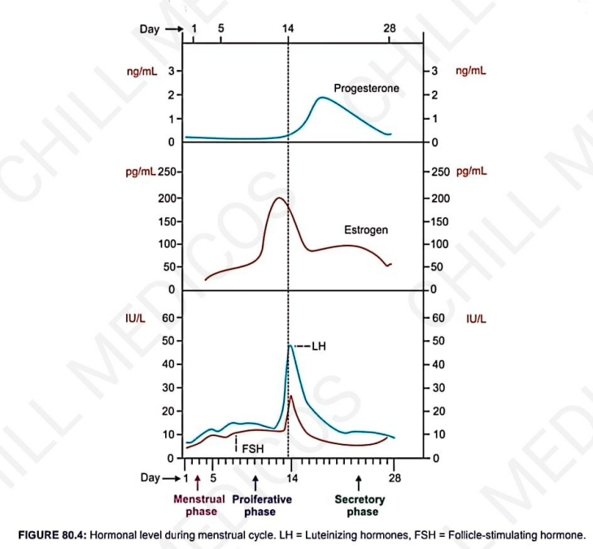
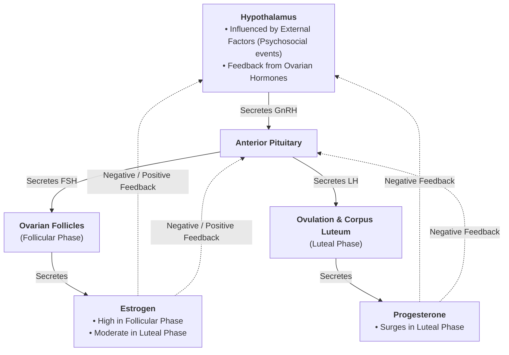

# HORMONAL REGULATION OF MENSTRUAL CYCLE

* **Regulatory System :** A highly integrated neuroendocrine control system comprising the **Hypothalamus**, **Anterior Pituitary**, and **Ovary** (*Hypothalamo-Pituitary-Ovarian Axis*).
* **Key Hormones Involved :—**
  * 1. **Hypothalamic Hormone :** Gonadotropin-Releasing Hormone ($\text{GnRH}$)
  * 2. **Anterior Pituitary Hormones :** Follicle-Stimulating Hormone ($\text{FSH}$) & Luteinizing Hormone ($\text{LH}$)
  * 3. **Ovarian Hormones :** Estrogen & Progesterone

---

## HYPOTHALAMO-PITUITARY-OVARIAN AXIS

> 

---

### 1. HYPOTHALAMIC HORMONE — GnRH

* **Mechanism :** $\text{GnRH}$ triggers cyclic changes by **stimulating the secretion of $\text{FSH}$ and $\text{LH}$** from the anterior pituitary gland.
* **Regulation of Secretion :** $\text{GnRH}$ secretion depends upon **2 factors**:
  * 1. **External Factors :** Psychosocial events, stress, environmental changes.
  * 2. **Feedback Effects :** Feedback regulation exerted by ovarian steroid hormones (estrogen and progesterone).

---

### 2. ANTERIOR PITUITARY HORMONES — FSH & LH

* Both $\text{FSH}$ and $\text{LH}$ **modulate ovarian and uterine changes** throughout the cycle.
* **Follicle-Stimulating Hormone (FSH) :**
  $$\text{FSH} \longrightarrow \text{Stimulates recruitment \& growth of immature ovarian follicles}$$
* **Luteinizing Hormone (LH) :**
  $$\text{LH} \longrightarrow \text{Triggers ovulation \& sustains the corpus luteum}$$

---

### 3. OVARIAN HORMONES — ESTROGEN AND PROGESTERONE

* **Estrogen :**
  $$\text{Ovarian Follicles} \longrightarrow \text{Estrogen} \longrightarrow \begin{cases} \text{Follicular Phase} \\ \text{Luteal Phase} \end{cases}$$
* **Progesterone :**
  $$\text{Corpus Luteum} \longrightarrow \text{Progesterone} \longrightarrow \text{Luteal Phase}$$

> **Note :** Both ovarian hormones are under the primary regulatory control of **$\text{GnRH}$**, which acts indirectly via **$\text{FSH}$ and $\text{LH}$**.

