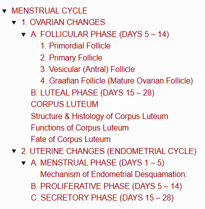
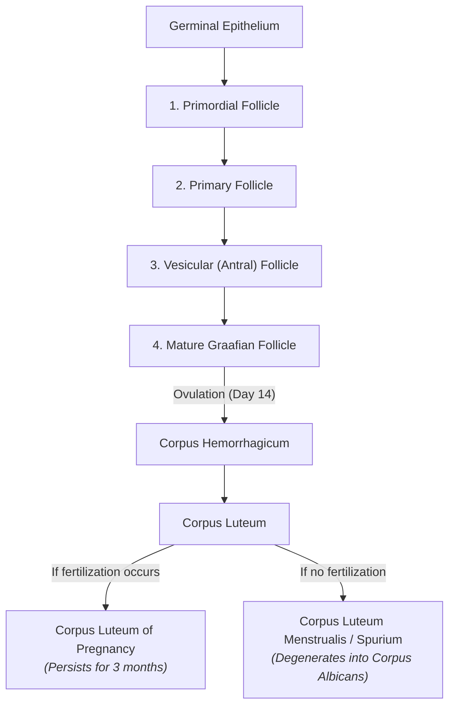
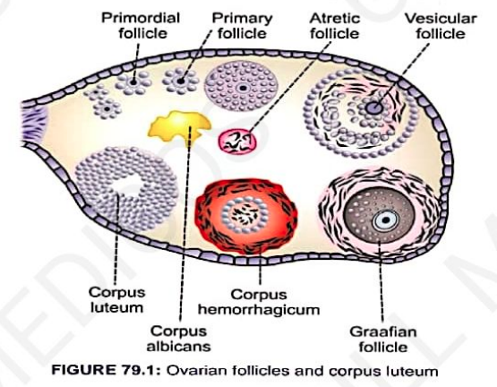
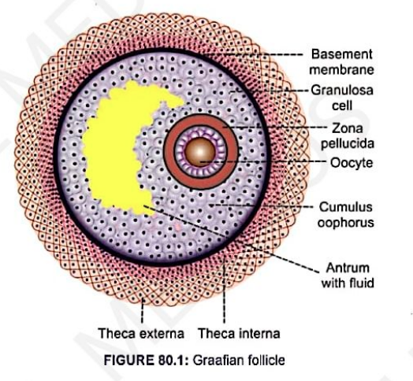
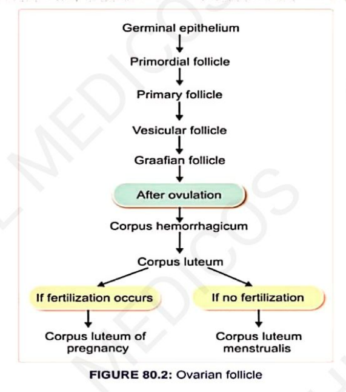
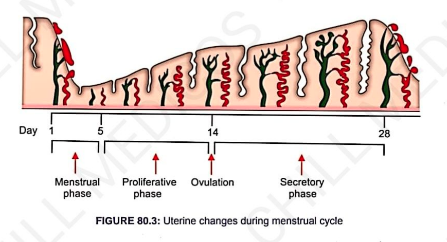
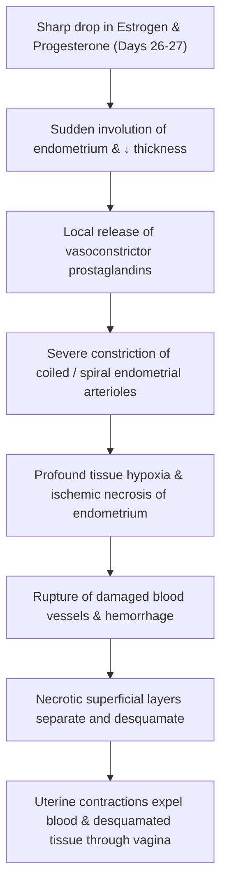

# MENSTRUAL CYCLE

> ### Headings
> 

* **Definition :** Cyclic events that take place in a rhythmic fashion during the reproductive period of a woman's life.
* **Menarche :** Commencement of the menstrual cycle at puberty.
* **Menopause :** Permanent cessation of the menstrual cycle, usually occurring at the age of $45 - 50\text{ years}$.
* **Duration :** Typically **28 days** (normal physiological range: $21 - 35\text{ days}$).
* **Associated Organs :** A series of synchronized changes occur in the:
  * 1. Ovary (*Ovarian changes*)
  * 2. Uterus (*Uterine / Endometrial changes*)
  * 3. Vagina (*Vaginal changes*)
  * 4. Cervix (*Cervical changes*)

---

## 1. OVARIAN CHANGES

Ovarian changes during each menstrual cycle occur in **2 principal phases**:
* A. **Follicular Phase** (Days 1 to 14)
* B. **Luteal Phase** (Days 15 to 28)

---

### A. FOLLICULAR PHASE (DAYS 5 – 14)

* Extends from the end of menstruation up to ovulation (Days 5 to 14).
* Characterized by the **maturation of the ovum** along with the **development of ovarian follicles**.
* **Ovarian Follicles :** Glandular structures present in the ovarian cortex consisting of an ovum surrounded by epithelial cells (*granulosa cells*).

---

#### 1. Primordial Follicle

* At puberty, both ovaries contain approximately **400,000 primordial follicles**.
* Consists of an ovum incompletely surrounded by a single layer of flattened spindle/granulosa cells.
* Granulosa cells provide nutrition to the ovum during childhood and secrete **Oocyte Maturation Inhibiting Factor (OMIF)** to arrest the ovum in an immature state.
* *No new ova develop after birth.*

> 

#### 2. Primary Follicle

* Formed when the ovum is completely surrounded by a uniform layer of cuboidal granulosa cells.
* Marked by the proliferation of granulosa cells, $\uparrow$ increase in follicle size, growth of the ovum, and onset of connective tissue capsule formation.

#### 3. Vesicular (Antral) Follicle

* Under the influence of **FSH**, about 6 to 12 primary follicles begin accelerated growth into vesicular follicles:
* **a. Changes in Granulosa Cells:**
* A fluid-filled space called the **follicular cavity (antrum)** develops among granulosa cells, filled with *liquor folliculi*.
* The ovum is displaced to one side, resting on a hillock of granulosa cells called the **germ hill (cumulus oophorus)**.
* Granulosa cells lining the antrum form the **membrana granulosa**.
* Granulosa cells immediately surrounding the ovum become columnar, forming the **corona radiata**.

* **b. Changes in Ovum:**
* Ovum diameter increases up to **$100 - 150\ \mu\text{m}$**; nucleus becomes larger and vesicular; cytoplasm becomes granular.
* A thick, transparent glycoprotein membrane, the **zona pellucida**, forms around the ovum.
* A narrow cleft called the **perivitelline space** separates the ovum from the zona pellucida.

* **c. Formation of Capsule (Theca Folliculi):**
* Spindle cells of the surrounding ovarian stroma condense to form the *theca folliculi*, which differentiates into 2 layers:
* **Theca Interna:** Highly vascular inner layer containing lipid granules; actively secretes **estrogen**.
* **Theca Externa:** Fibrous outer protective layer composed of thickly packed connective tissue fibers and spindle cells.

* *Fate of other follicles:* Only one follicle achieves full maturity; all other developing vesicular follicles undergo degeneration via **apoptosis** to become **atretic follicles**.

#### 4. Graafian Follicle (Mature Ovarian Follicle)

* Named after **Regnier de Graaf**.
* **Key Maturation Events :—**
* Follicle diameter enlarges up to **$10 - 12\text{ mm}$**.
* Encroaches upon the *tunica albuginea* and protrudes onto the surface of the ovary as an avascular spot called the **stigma**.
* Antrum expands; theca interna doubles in thickness and develops an extensive capillary network.
* On the **14ᵗʰ day** of the cycle, under the **LH surge**, the Graafian follicle ruptures, releasing the ovum into the peritoneal cavity (**Ovulation**).

> 

---

### B. LUTEAL PHASE (DAYS 15 – 28)

* Extends between the **15ᵗʰ and 28ᵗʰ day** of the menstrual cycle, characterized by the development and functional life of the **corpus luteum**.

> 

---

### CORPUS LUTEUM

* **Definition :** A yellow, temporary glandular endocrine body developed from the ruptured Graafian follicle after expulsion of the ovum.
* **Development :—**

$$\text{Rupture of Graafian follicle and release of ovum}$$

$$\downarrow$$

$$\text{Follicular cavity fills with blood} \longrightarrow \textbf{Corpus Hemorrhagicum}$$

$$\downarrow$$

$$\text{Blood clot replaced by serous fluid containing fibrin}$$

$$\downarrow$$

$$\text{Granulosa and theca cells undergo \textbf{Luteinization}} \longrightarrow \textbf{Corpus Luteum}$$

---

### Structure & Histology of Corpus Luteum

* **Granulosa Lutein Cells :** Derived from granulosa cells; contain abundant fine lipid granules and a yellowish carotenoid pigment that gives the gland its characteristic yellow color.
* **Theca Lutein Cells :** Derived from theca interna cells; contain lipid granules but lack yellow pigment.

---

### Functions of Corpus Luteum

* **1. Secretion of Hormones (Temporary Endocrine Gland) :—**
* **Progesterone :** Secreted in large quantities by **granulosa lutein cells**.
* **Estrogen :** Secreted in small quantities by **theca lutein cells**.

* **2. Maintenance of Pregnancy :—**
* If pregnancy occurs, the corpus luteum remains functionally active for the **first 3 months** until the placenta takes over hormone synthesis.
* If it becomes inactive prematurely, spontaneous **abortion** occurs.

---

### Fate of Corpus Luteum

---

## 2. UTERINE CHANGES (ENDOMETRIAL CYCLE)

> 

Occurs simultaneously with ovarian hormonal fluctuations and is divided into **3 phases**:

* 1. **Menstrual Phase** (Days 1 to 5)

* 2. **Proliferative Phase** (Days 5 to 14)

* 3. **Secretory Phase** (Days 15 to 28)

---

### A. MENSTRUAL PHASE (DAYS 1 – 5)

* If pregnancy does not occur, the thickened functional layer of the endometrium is desquamated and expelled through the vagina along with blood and serous tissue fluid (**Menstruation / Menses / Catamenia**).
* **Duration :** Lasts for **$4 - 5\text{ days}$**.
* **Primary Trigger :** Sharp fall in circulating levels of **estrogen and progesterone** around day 26 – 27 of the preceding cycle.

#### Mechanism of Endometrial Desquamation:

* **Blood Loss :** Approximately **$35\text{ mL}$ of blood** along with **$35\text{ mL}$ of serous fluid** (total $\approx 70\text{ mL}$).
* **Non-Clotting Nature of Menstrual Blood :** High concentrations of **fibrinolysin** in uterine tissue lyse clots within the uterine cavity, so normal menstrual discharge does not contain organized blood clots.

---

### B. PROLIFERATIVE PHASE (DAYS 5 – 14)

* Extends from the 5ᵗʰ day up to the 14ᵗʰ day of the cycle (corresponds to the **follicular phase** of the ovary).
* Influenced primarily by **Estrogen** secreted by the developing ovarian follicles.
* **Endometrial Changes :—**
* Rapid proliferation of endometrial stromal cells.
* Re-epithelialization of the denuded uterine surface completes within the **first 4 to 7 days**.
* Uterine tubular glands begin developing within the endometrial stroma.
* New blood vessels (spiral arteries) sprout into the newly formed stroma.
* Thickness of the endometrium increases progressively to **$3 - 4\text{ mm}$**.

* Ends with **Ovulation** on Day 14 under the influence of the **LH surge**.

---

### C. SECRETORY PHASE (DAYS 15 – 28)

* Extends from the 15ᵗʰ day to the 28ᵗʰ day (corresponds to the **luteal phase** of the ovary).
* Maintained by large amounts of **Progesterone** and small amounts of **Estrogen** secreted by the active corpus luteum.
* **Endometrial Changes :—**
* **Endometrial Glands:** Become tortuous, corkscrew-shaped, dilated, and actively secrete nutrient glycogen-rich fluid (*uterine milk*).
* **Stromal Cells:** Accumulate abundant glycogen and lipid droplets in their cytoplasm.
* **Vascularity:** Spiral arteries elongate, coil markedly, and increase blood supply to the functional zone.
* **Thickness:** Endometrial thickness reaches a maximum of **up to $6\text{ mm}$**.

---

