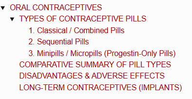

# ORAL CONTRACEPTIVES

> ### Headings
> 

* **Definition :** Drugs taken orally (pills) to prevent pregnancy by inhibiting the maturation of follicles and preventing ovulation.
* **Effect on Menstrual Cycle :** Alters the normal cycle into an **anovulatory cycle**.
* **Pill Method (Fertility Control) :** Pills contain synthetic preparations of **Estrogen + Progesterone**.
* **Classification :** Classified into **3 types**:
  * 1. Classical / Combined Pills
  * 2. Sequential Pills
  * 3. Minipills / Micropills

---

## TYPES OF CONTRACEPTIVE PILLS

### 1. Classical / Combined Pills

* **Composition :—**
  * Moderate dose of **synthetic estrogen** *(Ethinyl estradiol or Mestranol)* $+$
  * Mild dose of **synthetic progesterone** *(Norethindrone or Norgestrel)*.
* **Duration / Regimen :** Taken daily from the **5ᵗʰ to 25ᵗʰ day** of the menstrual cycle.
  * *Withdrawal of pills after the 25ᵗʰ day induces withdrawal (menstrual) bleeding.*
* **Mechanism of Action :—**
  $$\text{Continuous intake of combined pills}$$
  $$\downarrow$$
  $$\text{High circulating levels of Estrogen \& Progesterone}$$
  $$\downarrow$$
  $$\text{Suppresses release of gonadotropins (LH \& FSH) via negative feedback}$$
  $$\downarrow$$
  $$\text{Prevents follicular maturation and inhibits ovulation}$$
  * *Additional Progesterone Effect:* $\uparrow$ Increases viscosity/thickness of cervical mucus, making it hostile to sperm transport.

---

### 2. Sequential Pills

* **Composition :** High dose of estrogen $+$ moderate dose of progesterone.
* **Duration / Regimen :—**
  * Estrogen alone taken daily for **15 days** *(from 5ᵗʰ to 20ᵗʰ day)*.
  * Combined with progesterone during the **last 5 days** *(from 21ˢᵗ/23ʳᵈ to 28ᵗʰ day)*.
* **Action :** Primarily **prevents ovulation**.

---

### 3. Minipills / Micropills (Progestin-Only Pills)

* **Composition :** Low dose of **progesterone only** (estrogen-free).
* **Duration / Regimen :** Taken continuously **throughout the entire menstrual cycle**.
* **Mechanism of Action :—**
  * Prevents pregnancy **without necessarily suppressing ovulation**.
  * $\uparrow$ Increases thickness of cervical mucus $\longrightarrow$ **inhibits sperm motility and transport**.
  * Alters the endometrium $\longrightarrow$ **prevents implantation** of the blastocyst.

---

## COMPARATIVE SUMMARY OF PILL TYPES

<table>
  <thead>
    <tr>
      <th align="left">Type of Pill</th>
      <th align="left">Hormonal Composition</th>
      <th align="left">Dosing Schedule</th>
      <th align="left">Primary Mode of Action</th>
    </tr>
  </thead>
  <tbody>
    <tr>
      <td><b>1. Combined Pills</b></td>
      <td>Synthetic Estrogen + Synthetic Progestin</td>
      <td>Days 5 to 25 of cycle (21 days on, 7 days off)</td>
      <td>Suppresses FSH/LH surge $\longrightarrow$ <b>Inhibits ovulation</b> + thickens cervical mucus</td>
    </tr>
    <tr>
      <td><b>2. Sequential Pills</b></td>
      <td>High-dose Estrogen followed by Estrogen + Progesterone</td>
      <td>Estrogen for 15 days, then Progestin added for last 5 days</td>
      <td><b>Inhibits ovulation</b></td>
    </tr>
    <tr>
      <td><b>3. Minipills</b></td>
      <td>Low-dose Progestin only</td>
      <td>Daily continuously throughout the entire cycle</td>
      <td><b>Thickens cervical mucus</b> + prevents implantation (ovulation may continue)</td>
    </tr>
  </tbody>
</table>

---

## DISADVANTAGES & ADVERSE EFFECTS

* a. **Compliance Issue :** Major practical difficulty is maintaining strict regular daily intake.
* b. **Medical Contraindications :** Not suitable for women with diabetes mellitus, cardiovascular diseases, or hepatic disorders.
* c. **Thromboembolism Risk :** Increased blood clotting tendency due to suppressed hepatic synthesis of physiological anticoagulants.
* d. **Cardiovascular Risks :** Hypertension and increased risk of myocardial infarction (heart attack).
* e. **Cerebrovascular Risk :** $\uparrow$ Increased risk of stroke.
* f. **Breast Pathologies :** Breast tenderness and potential $\uparrow$ increased risk of breast cancer.

---

## LONG-TERM CONTRACEPTIVES (IMPLANTS)

* **Purpose :** Used to avoid the necessity of daily pill compliance.
* **Form :** Subdermal implants placed beneath the skin containing **progesterone / progestins**.
* **Mechanism & Efficacy :—**
  $$\text{Subdermal implant releases progestin slowly and continuously}$$
  $$\downarrow$$
  $$\text{Provides long-term reversible contraception for \textbf{4 to 5 years}}$$
  $$\downarrow$$
  $$\text{Common side effect: May produce amenorrhea or irregular spotting}$$
