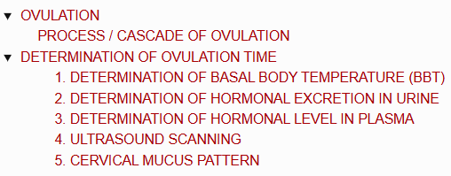
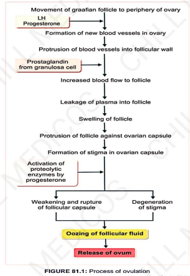
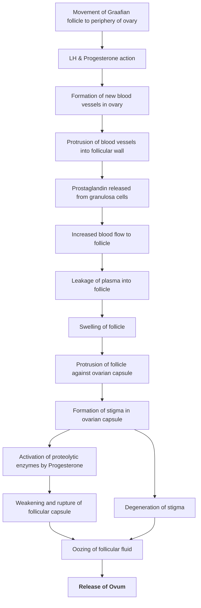

# OVULATION

> ### Headings
> 

* **Definition :** The physiological process by which a mature Graafian follicle ruptures and the ovum is released into the abdominal cavity.
* **Timing :** Occurs characteristically on the **14ᵗʰ day** of a normal 28-day menstrual cycle.
* **Number of Ova :** Only **one ovum** is typically released from one of the ovaries per cycle.
* **Primary Trigger :** **Luteinizing Hormone (LH)** is primarily responsible for inducing ovulation (*LH surge*).

---

## PROCESS / CASCADE OF OVULATION

> 

---

# DETERMINATION OF OVULATION TIME

* **5 Methods to Determine Ovulation Time :—**
  * 1. Determination of Basal Body Temperature (BBT)
  * 2. Determination of hormonal excretion in urine
  * 3. Determination of hormonal level in plasma
  * 4. Ultrasound scanning
  * 5. Cervical mucus pattern

---

### 1. DETERMINATION OF BASAL BODY TEMPERATURE (BBT)

$$\text{Measured during the mid-period of the menstrual cycle}$$
$$\downarrow$$
$$\text{In the morning by placing a thermometer in the rectum / vagina}$$
$$\downarrow$$
$$\text{Fall in basal temperature prior to ovulation } (\pm\, 0.3^\circ\text{C} - 0.5^\circ\text{C})$$
$$\downarrow$$
$$\text{After ovulation } \longrightarrow \uparrow \text{increase in temperature due to \textbf{thermogenic effect of progesterone}}$$

---

### 2. DETERMINATION OF HORMONAL EXCRETION IN URINE

$$\uparrow \text{Increase in excretion of metabolic end products of estrogen \& progesterone}$$
$$\downarrow$$
* **Estrogen End Products :** Estrone, Estriol, $17\text{-}\beta\text{-estradiol}$
* **Progesterone End Product :** Pregnanediol

---

### 3. DETERMINATION OF HORMONAL LEVEL IN PLASMA

* **At the Time of Ovulation :—**
  * a. $\text{FSH}$ level $\downarrow$ decreases
  * b. $\text{LH}$ level $\uparrow$ increases
  * c. $\text{Estrogen}$ level $\uparrow$ increases
* **After Ovulation :—**
  * $\text{Progesterone}$ level $\uparrow$ increases

---

### 4. ULTRASOUND SCANNING

* The process of follicular growth, maturation, and rupture can be directly observed via **ultrasound scanning**.

---

### 5. CERVICAL MUCUS PATTERN

$$\text{Examined under a microscope } \longrightarrow \text{shows a characteristic \textbf{Fern Pattern}}$$
$$\downarrow$$
$$\text{Pattern \textbf{disappears} after ovulation}$$

