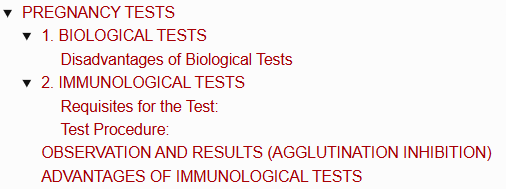
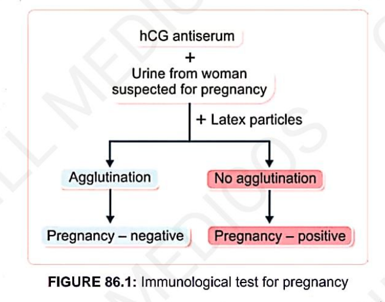
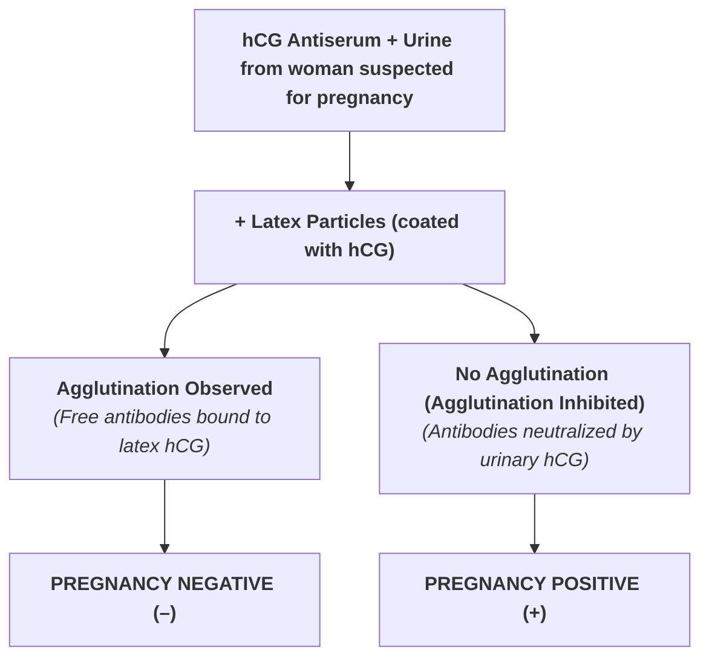

# PREGNANCY TESTS

> ### Headings
> 

* **Definition :** Diagnostic tests used to detect or confirm pregnancy.
* **Underlying Principle :** Based on determining the presence of **Human Chorionic Gonadotropin (hCG)** in the maternal urine.
* **Categories :**
  * 1. **Biological Tests** (performed on experimental animals)
  * 2. **Immunological Tests** (based on antigen-antibody reactions)

---

## 1. BIOLOGICAL TESTS

* Performed using **experimental animals**.
* Can be performed only **2 to 3 weeks after conception**.

<table>
  <thead>
    <tr>
      <th align="left">Test Name</th>
      <th align="left">Animal Used</th>
      <th align="left">Procedure & Route</th>
      <th align="left">Observation & Time Frame</th>
    </tr>
  </thead>
  <tbody>
    <tr>
      <td><b>1. Aschheim-Zondek Test</b> <i>(1ˢᵗ test invented)</i></td>
      <td>Immature female mice</td>
      <td>$2\text{ mL}$ of urine injected subcutaneously daily for 2 days.</td>
      <td>
        • Mice killed after 5 days. 
        • Ovaries examined for <b>corpus lutea / hemorrhagic spots</b> (indicates hCG-induced ovulation).
      </td>
    </tr>
    <tr>
      <td><b>2. Kupperman Test</b> <i>(Modification of AZ test)</i></td>
      <td>Immature female rat</td>
      <td>
        • $2\text{ mL}$ urine injected subcutaneously <b>OR</b> 
        • Injected intraperitoneally.
      </td>
      <td>
        • Subcutaneous: Ovarian changes seen after <b>6 hours</b>. 
        • Intraperitoneal: Ovarian changes seen after <b>2 hours</b>.
      </td>
    </tr>
    <tr>
      <td><b>3. Friedman Test</b></td>
      <td>Mature virgin female rabbit</td>
      <td>$10 - 15\text{ mL}$ of urine injected <b>intravenously</b> (into ear vein).</td>
      <td>Ovaries examined for ruptured follicles / corpus lutea after <b>48 hours</b>.</td>
    </tr>
    <tr>
      <td><b>4. Hogben Test</b></td>
      <td>Female South African toad <i>(Xenopus laevis)</i></td>
      <td>$20 - 30\text{ mL}$ of urine injected into the <b>dorsal lymph sac</b>.</td>
      <td>hCG stimulates extrusion of ova / ovulation within <b>12 hours</b>.</td>
    </tr>
    <tr>
      <td><b>5. Galli-Mainini Test</b></td>
      <td>Male amphibian (toad/frog)</td>
      <td>$2\text{ mL}$ of urine injected into the subcutaneous/lymph space.</td>
      <td>hCG causes <b>expulsion of spermatozoa</b> in urine/cloacal fluid within <b>2 hours</b>.</td>
    </tr>
  </tbody>
</table>

---

### Disadvantages of Biological Tests
* a. Require maintenance of animal houses and live experimental animals.
* b. Can only be performed after 2 to 3 weeks of conception.
* c. Results are delayed (require waiting between 2 to 48 hours).
* d. Involves sacrificing animals.

---

## 2. IMMUNOLOGICAL TESTS

* **Basis :** Based on **double antigen-antibody reactions** (agglutination-inhibition principle).
* **Commonest Test :** **Gravindex Test**.
* **Principle :** Determining the inhibition of agglutination of **latex particles** (or sheep RBCs) coated with hCG.

---

### Requisites for the Test:
* 1. **hCG Antiserum :** Obtained from rabbits immunized against human hCG (contains rabbit anti-hCG antibodies).
* 2. **Latex Particles / Sheep RBCs :** Coated with pure hCG molecules.
* 3. **Urine Sample :** Fresh morning urine sample from the woman suspected of being pregnant.

---

### Test Procedure:
$$\text{Step 1: } 1\text{ drop of hCG Antiserum} + 1\text{ drop of Urine } \longrightarrow \text{Mix well on glass slide}$$
$$\downarrow$$
$$\text{Step 2: Add } 1\text{ drop of hCG-coated Latex Particles}$$

---

## OBSERVATION AND RESULTS (AGGLUTINATION INHIBITION)

> 

---

## ADVANTAGES OF IMMUNOLOGICAL TESTS

* a. **High Accuracy :** Much more accurate, specific, and reproducible than biological tests.
* b. **Rapid Results :** Results are obtained within **a few minutes**.
* c. **Simplicity :** Easy to perform with minimal laboratory equipment.
* d. **Early Detection :** Can detect pregnancy as early as the **6ᵗʰ day of conception** (even within the first few days).
* e. **Convenience :** Highly sensitive, single-step methods available in the form of rapid **pregnancy test cards/cassettes**.
