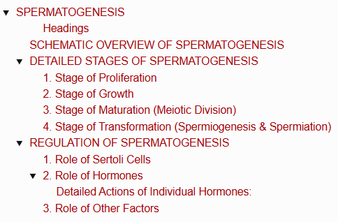
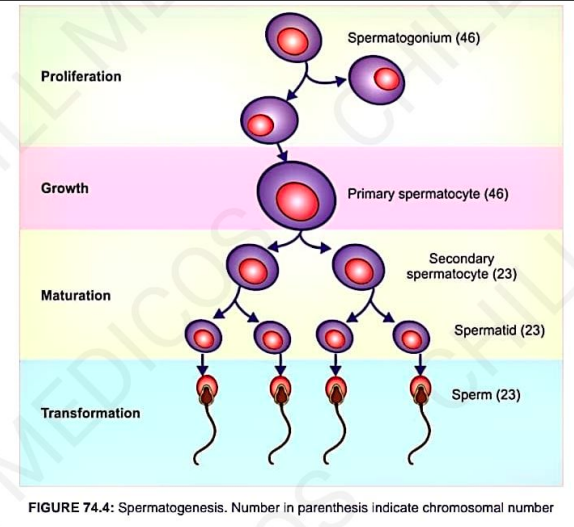
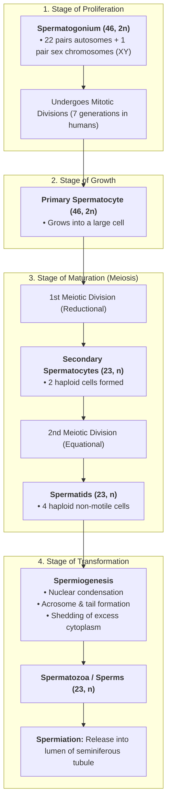
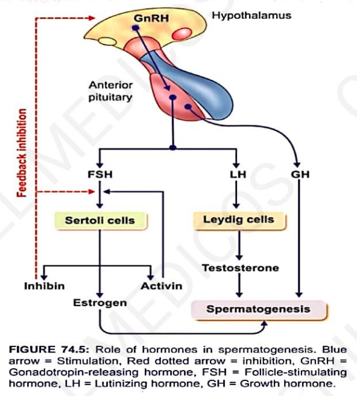
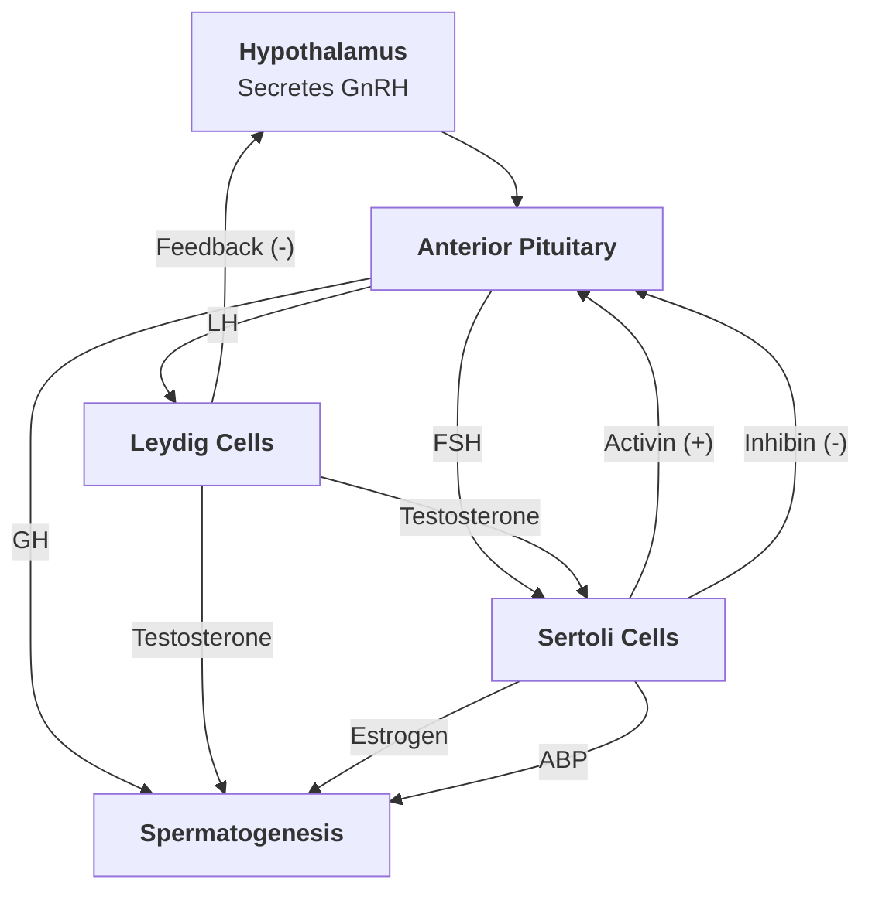

# SPERMATOGENESIS

> ### Headings
> 

* **Definition :** Process by which male gametes called **spermatozoa (sperms)** are formed from primitive spermatogenic cells (**spermatogonia**) in the testis.
* **Duration :** Takes **74 days** for the complete formation of a mature sperm from a primitive germ cell.
* **Sertoli Cell Attachment :** Spermatogenic cells maintain cytoplasmic connections with Sertoli cells, which supply essential nutrients and regulatory factors.
* **Stages :** Occurs in **4 sequential stages**:
  * 1. Stage of Proliferation
  * 2. Stage of Growth
  * 3. Stage of Maturation
  * 4. Stage of Transformation (*Spermiogenesis*)

---

## SCHEMATIC OVERVIEW OF SPERMATOGENESIS

> 

---

## DETAILED STAGES OF SPERMATOGENESIS

### 1. Stage of Proliferation

* Each spermatogonium contains **23 pairs of chromosomes** ($22\text{ pairs of autosomes} + 1\text{ pair of sex chromosomes } [XY]$).
* Spermatogonia divide repeatedly by **mitosis** without reducing chromosome number.
* In humans, spermatogonia undergo usually **7 generations** of mitotic division before the final generation enters the growth stage as a **primary spermatocyte**.

### 2. Stage of Growth

* The primary spermatocyte accumulates cytoplasm and grows into a **large cell** with no other major morphological changes.

### 3. Stage of Maturation (Meiotic Division)

* **First Phase (Meiosis I) :** Each primary spermatocyte ($46\text{ chromosomes}$) undergoes reduction division to form **2 secondary spermatocytes**, each receiving the **haploid number of chromosomes ($23$)**.
* **Second Phase (Meiosis II) :** Each secondary spermatocyte divides equationally into **2 smaller haploid spermatids ($23\text{ chromosomes}$)** *(yielding a total of 4 spermatids per primary spermatocyte)*.

### 4. Stage of Transformation (Spermiogenesis & Spermiation)

* No further cell division occurs.
* **Spermiogenesis :** Morphological differentiation of round spermatids into streamlined, motile spermatozoa:
  * 1. Condensation of nuclear chromatin.

  * 2. Formation of the **acrosome**, middle piece (mitochondrial spiral sheath), and flagellar **tail**.

  * 3. Removal/phagocytosis of extraneous, non-essential cytoplasm by Sertoli cells.

* **Spermiation :** The final detachment and release of mature spermatozoa from Sertoli cells into the **lumen of seminiferous tubules**.

---

## REGULATION OF SPERMATOGENESIS

Spermatogenesis is influenced by:

* 1. Sertoli cells

* 2. Hormones (*Hypothalamo-Pituitary-Gonadal Axis*)

* 3. Other physiological & environmental factors

---

### 1. Role of Sertoli Cells

* Support and nourish developing germ cells.
* Provide hormonal substances and paracrine regulators necessary for spermatogenesis.
* Secrete **Androgen-Binding Protein (ABP)** to maintain high local testosterone levels.
* Facilitate **spermiation** (release of sperms into tubular lumen).

---

### 2. Role of Hormones

* **Key Hormones Involved :—**
  * 1. Follicle-Stimulating Hormone (FSH)
  * 2. Testosterone
  * 3. Estrogen
  * 4. Luteinizing Hormone (LH)
  * 5. Growth Hormone (GH)
  * 6. Inhibin
  * 7. Activin

---

<table>
  <thead>
    <tr>
      <th align="left">Stage of Spermatogenesis</th>
      <th align="left">Hormones Necessary</th>
    </tr>
  </thead>
  <tbody>
    <tr>
      <td><b>Stage of proliferation</b></td>
      <td>
        • Follicle-stimulating hormone (FSH) 
        • Growth hormone (GH)
      </td>
    </tr>
    <tr>
      <td><b>Stage of growth</b></td>
      <td>
        • Testosterone 
        • Growth hormone (GH)
      </td>
    </tr>
    <tr>
      <td><b>Stage of maturation</b></td>
      <td>
        • Testosterone 
        • Growth hormone (GH)
      </td>
    </tr>
    <tr>
      <td><b>Stage of transformation</b></td>
      <td>
        • Testosterone 
        • Estrogen
      </td>
    </tr>
  </tbody>
</table>

> 

#### Detailed Actions of Individual Hormones:

* **a. FSH (Follicle-Stimulating Hormone) :—**
  * Responsible for the **initiation of spermatogenesis**.
  * Binds to receptors on Sertoli cells and spermatogonia to induce mitotic proliferation.
  * Stimulates Sertoli cells to synthesize **Estrogen** and **Androgen-Binding Protein (ABP)**.

* **b. Testosterone :—**
  * Secreted by Leydig (interstitial) cells; responsible for the **maintenance of spermatogenesis** and progression of maturation stages.
  * Local concentration and activity are augmented by ABP.

* **c. Estrogen :—**
  * Converted from testosterone inside Sertoli cells via the enzyme aromatase; necessary for spermatid transformation.

* **d. LH (Luteinizing Hormone / ICSH) :—**
  * In males, called **Interstitial Cell-Stimulating Hormone (ICSH)**.
  * Essential for stimulating **Leydig cells to secrete testosterone**.

* **e. Growth Hormone (GH) :—**
  * Essential for baseline metabolic processes in the testes and promotes early proliferation of spermatogonia.

* **f. Inhibin :—**
  * Peptide hormone (transforming growth factor superfamily) secreted by Sertoli cells; selectively **inhibits FSH secretion** via negative feedback on the anterior pituitary.

* **g. Activin :—**
  * Peptide hormone secreted within gonads; **$\uparrow$ increases FSH secretion** and accelerates spermatogenesis.

---

### 3. Role of Other Factors

* **A. Temperature (Scrotal Thermoregulation) :—**
  * Spermatogenesis requires a temperature **$2^\circ\text{C}$ lower than core body temperature**, maintained by the scrotal sac.
  * Elevated testicular temperature stops spermatogenesis.
  * **Cryptorchidism (Undescended Testes) :** Testes remain in the abdomen $\longrightarrow$ exposure to higher core body temperature $\longrightarrow$ degeneration of seminiferous tubular epithelium $\longrightarrow$ **complete arrest of spermatogenesis (azoospermia)**.

* **B. Infectious Diseases :—**
  * Systemic viral infections like **Mumps** (causing orchitis) can trigger inflammatory degeneration of seminiferous tubules, leading to temporary or permanent **stoppage of spermatogenesis**.

