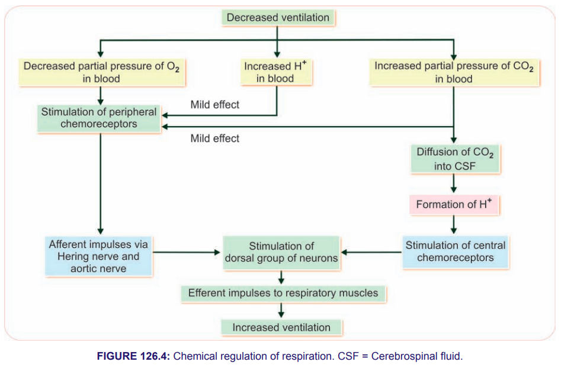

# Chemical Mechanism of Respitory System Regulation

* Chemical mechanism is operated through chemoreceptors.

  * They are sensory nerve endings.
  * Give response to changes in chemical constituents of blood.

## Changes in Chemical Constituents of Blood

1. Hypoxia (↓ PO₂)
2. Hypercapnea (↑ PCO₂)
3. ↑ H⁺ ion concentration

## Types of Chemoreceptors

2 groups:

1. Central chemoreceptors
2. Peripheral chemoreceptors

### 1. Central Chemoreceptors

* Chemoreceptors present in the brain.
* **Situation →** in deeper part of medulla oblongata, close to dorsal respiratory group of neurons.

  * Also known as **chemosensitive area**.
* Chemoreceptors are in close contact with blood & CSF.

#### Mechanism of Action

* Central chemoreceptors are connected with respiratory centers.

  * Dorsal respiratory group
  * Through synapses
* Act slowly but effectively.
* Responsible for 70–80% of increased ventilation through chemical regulatory mechanism.

* Main stimulant is ↑ hydrogen ions concentration.

* If H⁺ concentration rises in the blood:

  * It cannot stimulate the central chemoreceptors.
  * H⁺ from blood cannot cross the BBB & blood–cerebrospinal fluid barrier.

* If CO₂ rises in the blood:

  * It can easily cross the BBB.
  * Enters the interstitial fluid of brain / CSF.
  * CO₂ combines with H₂O → carbonic acid (H₂CO₃).
  * H₂CO₃ is unstable and immediately dissociates into H⁺ & HCO₃⁻.
  * H⁺ stimulates the central chemoreceptors.
  * Excitatory impulses are sent to the dorsal respiratory group of neurons.
  * Results in ↑ ventilation (↑ rate & force of breathing).
  * Excess CO₂ is washed out.
  * Respiration is brought back to normal.

### 2. Peripheral Chemoreceptors

* **Situation →** Chemoreceptors present in carotid & aortic region.

#### Mechanism of Action

* Hypoxia is the most potent stimulant.

  * Because of the presence of O₂-sensitive K⁺ channels in the glomus cells of peripheral chemoreceptors.
##### Hypoxia causes

↓
**Closure of O₂-sensitive K⁺ channels**

↓
**Prevents K⁺ efflux**

↓
**Depolarization of glomus cells**

↓
**Generation of action potentials in nerve endings**

↓
**Impulses pass through aortic & Hering nerves**

↓
**Excite dorsal groups of neurons**

↓
**Send excitatory impulses to respiratory muscles**

↓
**Increased ventilation**

↓
**Provides enough oxygen & rectifies the lack of O₂**

