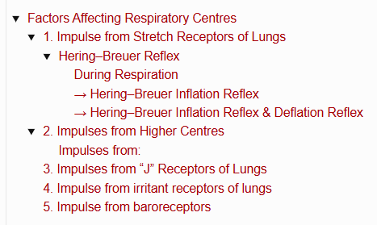
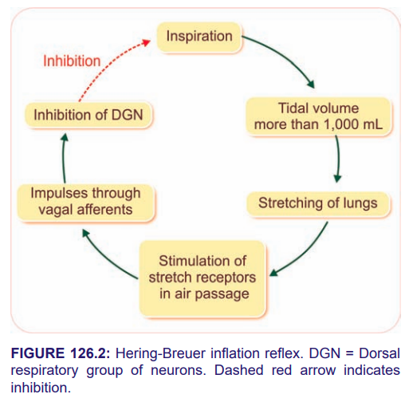
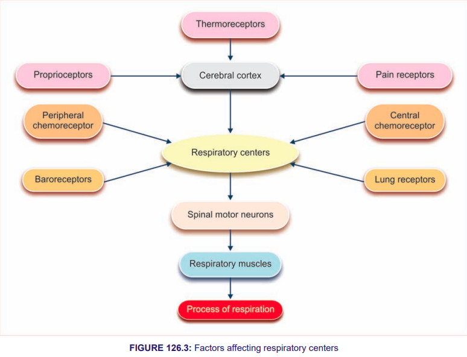

# Factors Affecting Respiratory Centres

> ### Headings
> 

* Respiratory centres regulate the respiratory movements by receiving impulses from various sources in the body.

## 1. Impulse from Stretch Receptors of Lungs

### Hering–Breuer Reflex

* Hering–Breuer reflex is a protective reflex that **restricts inspiration** and prevents overstretching of lung tissues.
* It is initiated by stimulation of **stretch receptors of air passages**, situated on the wall of **bronchi & bronchioles**.

#### During Respiration

**Inspiration**
↓
**Expansion of lungs**
↓
**Stimulates stretch receptors**
↓
**Impulses reach dorsal group neurons via vagal afferent fibres**
↓
**Inhibit them**
↓
**Inspiration stops & expiration starts**
↓
**Overstretching is prevented**

#### → Hering–Breuer Inflation Reflex

**Tidal volume > 1000 mL**
↓
**Stretching of lungs**
↓
**Stimulation of stretch receptors**
↓
**Impulses through vagal afferents**
↓
**Inhibition of DGN**
↓
**Inhibition of inspiration**

* Hering–Breuer reflex does **not operate during quiet breathing**.
* It operates only when **tidal volume rises beyond 1000 mL**.

#### → Hering–Breuer Inflation Reflex & Deflation Reflex

* Hering–Breuer inflation reflex **restricts inspiration** and limits the overstretching of lung tissues.
* The reverse of this reflex is the **Hering–Breuer deflation reflex**.

  * Takes place during **expiration**.
  * Stretching of lungs is absent, so **deflation occurs**.

## 2. Impulses from Higher Centres

* Higher centres alter respiration by sending impulses **directly to dorsal group of neurons**.

### Impulses from:

1. **Anterior cingulate gyrus**
2. **Genu of corpus callosum**
3. **Olfactory Tubercle**
4. **Posterior, occipital gyrus & cerebral cortex**

→ **Above 4 Inhibits respiration**

* Impulses from **motor area & Sylvian area of cerebral cortex** cause **forced breathing**.

## 3. Impulses from “J” Receptors of Lungs

* “J” receptors are **juxtacapillary receptors**.

  * Present on the wall of **alveoli** and in close contact with **pulmonary capillaries**.
* These receptors are **sensory nerve endings of vagus**.
* Nerve fibres of these receptors are **non-myelinated** and belong to **C-fibres**.

* Stimulation of J-receptors produce a reflex response

* Characterised by **apnea**, followed by:
  - **Hyperventilation**
  - **Bradycardia**
  - **Hypotension**
  - **Weakness of skeletal muscles**

* **Conditions** when **J-receptors** are **stimulated**
  1. Pulmonary congestion
  2. Pulmonary edema
  3. Pneumonia
  4. Over-inflation of lungs

## 4. Impulse from irritant receptors of lungs

- **Irritant receptors** present in bronchi & bronchioles.
- Stimulated by **irritant chemical agents** → ammonia, sulfur dioxide.
- Produces reflex **hyperventilation + bronchospasm**.
- Prevent entry of harmful agent in alveoli.

## 5. Impulse from baroreceptors

- **Baroreceptors or pressoreceptors** give response to change in BP.
- Baroreceptors in **carotid sinus & arch of aorta** give response to rise in BP.
- Send **inhibitory impulse** to vasomotor center in medulla oblongata.
- Causes **↓ in HR** and inhibition of respiration.

