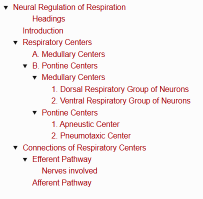
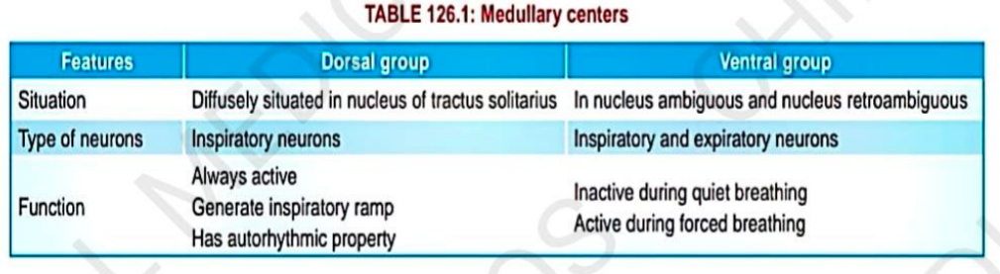
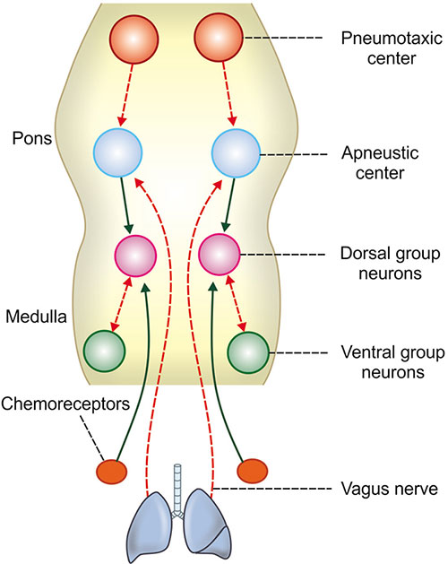

# Neural Regulation of Respiration

> ### Headings
> 

## Introduction
*Neural Regulation of Respiration includes:*

1. Respiratory centers
2. Afferent nerves
3. Efferent nerves

## Respiratory Centers

* Respiratory centers are a group of neurons that control the **rate, rhythm and force of respiration**.
* Centers are bilaterally situated in reticular formation of brainstem.
* Depending upon situation in brainstem:

### A. Medullary Centers

1. Dorsal respiratory group of neuron
2. Ventral respiratory group

### B. Pontine Centers

1. Apneustic center
2. Pneumotaxic center

#### Medullary Centers

##### 1. Dorsal Respiratory Group of Neurons

**Situation** 

→ In the nucleus of tractus solitarius (upper medulla oblongata).

* Collectively called **inspiratory center**.
* All neurons are inspiratory neurons & generate inspiratory ramp.

**Function →** Responsible for basic rhythm of respiration.

> ***Nervous regulation of respiration:*** 
> ***Solid green line = Stimulation,***
> ***Dotted red line = Inhibition***

##### 2. Ventral Respiratory Group of Neurons

**Situation**

→ In nucleus ambiguus and nucleus retroambiguus.

→ Situated in medulla oblongata, anterior and lateral to nucleus of tractus solitarius.

* Collectively called **excitatory center**.
* Has both inspiratory and expiratory neurons.

  * Found in central area of group.
  * On caudal and rostral areas of group.

**Function →**

* Inactive during quiet breathing & active during forced breathing.
* Neurons stimulate both inspiratory muscles and expiratory muscles.
#### Pontine Centers

##### 1. Apneustic Center

**Situation →** In the reticular formation of lower pons.

**Function →** Increases depth of inspiration by acting directly on dorsal group neurons.

##### 2. Pneumotaxic Center

**Situation →** In the dorsolateral part of reticular formation in upper pons.

* Formed by neurons of medial parabrachial and subparabrachial nuclei.
* Also called **ventral parabrachial (Kölliker-Fuse nucleus)**.

**Function →** It controls the medullary respiratory centers, particularly the dorsal group neurons.

* Acts through the apneustic center.
* Pneumotaxic center inhibits the apneustic center so that the dorsal group neurons are inhibited.
* Because of this, inspiration stops and expiration starts.
* Center increases respiratory rate by reducing the duration of inspiration.

## Connections of Respiratory Centers

### Efferent Pathway

* Nerve fibers from respiratory centers leave the brainstem.

  * Descend in the anterior part of the lateral columns of the spinal cord.
* Nerve fibers terminate on motor neurons in the anterior horn cells of cervical & thoracic segments of the spinal cord.

#### Nerves involved

1. **Phrenic nerve fibers (C3–C5)** → supply the diaphragm.
2. **Intercostal nerve fibers (T1–T11)** → supply external intercostal muscles.

* Vagus nerve also contains some efferent fibers from the respiratory center.

### Afferent Pathway

1. **Peripheral chemoreceptors & baroreceptors** → via branches of glossopharyngeal and vagus nerves.
2. **Stretch receptors of lungs** → via vagus nerves.

* These receptors send afferent impulses to the respiratory centers.
* Respiratory centers modulate the movements of the thoracic cage & lungs through efferent nerve fibers.
