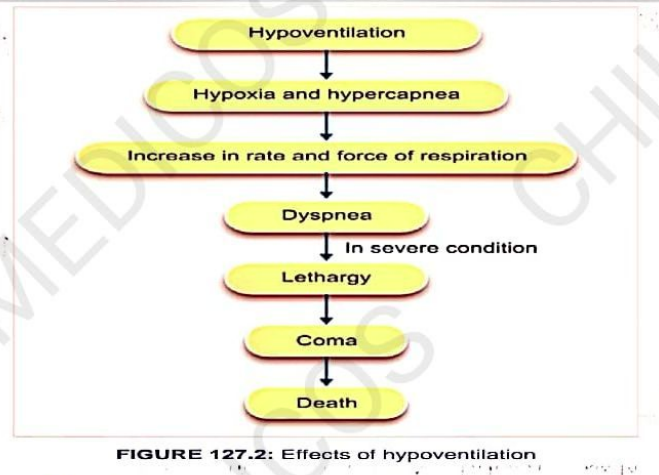
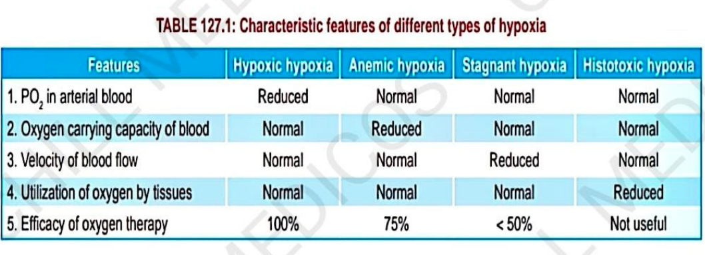

# Hypoxia

- Reduced availability of oxygen to the tissues.
- Anoxia refers to absence of oxygen.

# Classification and Causes of Hypoxia
## Important factors which lead to hypoxia

1. Oxygen tension in arterial blood
2. Oxygen-carrying capacity of blood
3. Velocity of blood flow
4. Utilization of O₂ by cells

## Types of Hypoxia

On the basis of these 4 factors, hypoxia is of 4 types:

1. Hypoxic hypoxia
2. Anemic hypoxia
3. Stagnant hypoxia
4. Histotoxic hypoxia

### 1. Hypoxic Hypoxia

Means **↓ oxygen content in blood**, also called arterial hypoxia.

#### Causes

##### 1. Low oxygen tension in inspired air

a) High altitude  
b) Breathing air in closed space  
c) Breathing gas mixture containing low partial pressure of oxygen (PO₂)

##### 2. Respiratory disorders associated with ↓ pulmonary ventilation

a) Pneumonia  
b) Depression of respiratory centre (in brain tumors)  
c) Obstruction of respiratory passages as in asthma  
d) Nervous and mechanical hindrance to respiratory movements (in poliomyelitis)
##### 3. Respiratory disorders associated with inadequate oxygenation of blood in lungs

a) Impaired alveolar diffusion as in emphysema  
b) Presence of non-functioning alveoli (in fibrosis)  
c) Lack of surfactant  
d) Pulmonary edema, pneumonia, pulmonary hemorrhage  
e) Collapse of lungs as in bronchiolar obstruction  
f) Pneumothorax, hydrothorax, hemothorax  

##### 4. Cardiac disorders

- In **congestive heart failure**, oxygen availability of different areas are normal.
- But blood cannot be pumped from heart properly.

### 2. Anemic Hypoxia

- Condition characterised by **inability of blood to carry enough amount of oxygen**; oxygen availability is normal.

#### Causes

- Any condition that causes anemia can cause anemic hypoxia.

##### 1. ↓ RBCs

a) Bone marrow diseases  
b) Hemorrhage  

##### 2. ↓ Hb content in blood

- Condition which ↓ the RBC count / change the structure, shape & size of RBC.
- ↓ the Hb content in blood.

##### 3. Formation of altered Hb

- Poisoning with **chlorates, nitrates, ferrocyanides** cause oxidation of Iron into **Ferric form** forming **Methemoglobin** which **can't carry oxygen**

##### 4.Combination of Hb with Gases Other Than O₂ & CO₂

- Hb combining with **CO (carbon monoxide), H₂S (hydrogen sulfide), or N₂O (nitrous oxide)**
- Hb loses capacity to transport oxygen.

### 3. Stagnant Hypoxia

- Hypoxia caused by **low velocity of blood flow**.
- Also called **hypokinetic hypoxia**.

#### Causes

Mainly due to reduction in velocity of blood flow:

1. Congestive cardiac failure
2. Hemorrhage
3. Surgical shock
4. Thrombosis
5. Embolism

### 4. Histotoxic Hypoxia

- Hypoxia produced by **inability of tissues to utilize oxygen**.

#### Causes

- Due to **cyanide or sulfide poisoning**.
- Poisonous substances destroy cellular oxidative enzymes, and there is a complete paralysis of **cytochrome oxidase system**.

# Effects of Hypoxia

- Acute and severe hypoxia leads to **unconsciousness**.
- Types of effects of hypoxia:
  1. Immediate effects
  2. Delayed effects

## 1. Immediate Effects

### 1) Effects on Blood

- ↑ Erythropoietin → ↑ production of RBC.
- ↑ Oxygen-carrying capacity of blood.

### 2) Effects on Cardiovascular System

- Stimulation of **cardiac & vasomotor centers**.
- ↑ Rate and force of contraction of heart.
- ↑ Cardiac output and BP.
- Later, all are reduced.

### 3) Effects on Respiration

- ↑ Respiratory rate due to **chemoreceptor reflex**.
- Large amount of CO₂ is washed out → **alkalemia**.
- Later, respiration tends to become **shallow and periodic**.

### 4) Effects on Digestive System

- Associated with loss of appetite.
- Nausea and vomiting.
- Mouth becomes dry.
- Feeling of thirst.

### 5) Effects on Kidney

- ↑ Secretion of **erythropoietin**.
- Alkaline urine is excreted.

### 6) Effects on CNS

- Symptoms are similar to those of **alcoholic intoxication**.
- Individual becomes depressed and apathetic, with loss of self-control.
- Person becomes talkative, ill-tempered and rude.
- Person starts shouting, singing or crying.

## 2. Delayed Effects of Hypoxia

- Depending upon the **length and severity of exposure to hypoxia**.
- Person becomes **irritable** and develops symptoms of **mountain sickness**, such as:
  - Nausea
  - Vomiting
  - Depression
  - Weakness
  - Fatigue

## Treatment for Hypoxia — Oxygen Therapy

- Oxygen therapy = treating the affected person with **oxygen**.

### Methods

1. Placing the patient's head in an **"O₂ tent"** containing O₂.
2. Allowing the patient to breathe oxygen either:
   - From a **mask**, or
   - An **intranasal tube**.

### Effectiveness of Oxygen Therapy

- **Hypoxic hypoxia** → Oxygen therapy is **100% useful**.
- **Anemic hypoxia** → Moderately effective (**~70%**).
- **Stagnant hypoxia** → Less than **50%** effective.
- **Histotoxic hypoxia** → **Not useful at all**.
