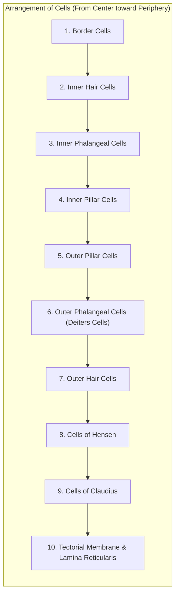

# ORGAN OF CORTI

* **Definition :** The receptor organ for hearing; a specialized neuroepithelial structure situated in the cochlea.
* **Situation & Extent :**
  * Rests upon the lip of the **osseous spiral lamina** and the **basilar membrane**.
  * Extends throughout the length of the **cochlear duct**, except for a short distance at either end.
* **Roof :** Formed by the gelatinous **tectorial membrane**.

---

## CELLULAR ARCHITECTURE

Made up of sensory elements called **hair cells** and various specialized **supporting cells**. The cellular elements are arranged in a specific medial-to-lateral order from the center (modiolus) toward the periphery:

---

## DETAILS OF CELLULAR COMPONENTS

### 1. Border Cells

* Slender columnar cells arranged in a single layer on the **tympanic lip** along the inner side of the inner hair cells.
* The apical surfaces of border cells possess a distinct **cuticle**.

---

### 2. Inner Hair Cells

* **Shape :** Flask-shaped cells, broader than outer hair cells.
* **Arrangement :** Arranged in a **single layer / row**, occupying only the upper portion of the epithelial layer.
* **Base :** The rounded base of each cell rests upon adjacent supporting cells termed **inner phalangeal cells**.
* **Apical Surface :** Bears a cuticular plate and specialized **stereocilia** (the largest stereocilium is termed the **kinocilium**).
* **Innervation :** Inner and outer hair cells collectively form the **receptor cells** of hearing; both receive afferent and efferent nerve fibers.

---

### 3. Inner Phalangeal Cells

* Act as primary supporting cells for the inner hair cells.
* Arranged in a single row along the inner surface of the inner pillar cells.
* **Base :** Rests directly on the **basilar membrane**.
* **Apex :** The cuticular plate of these cells resembles finger bones (**phalanges**).

---

### 4 & 5. Inner and Outer Pillar Cells *(Rods of Corti)*

* **Structure :** Each pillar cell consists of a broader base, an elongated body/pillar, and a head at the tip.
* **Attachments :**
* **Bases of inner pillar cells :** Lie close to the lip of the osseous spiral lamina (*tympanic lip*).
* **Bases of outer pillar cells :** Rest close to the **basilar membrane**.

* **Tunnel of Corti :** The inclined pillars meet at their heads to form a series of arches, enclosing a central triangular space termed the **Inner Tunnel / Tunnel of Corti**.

---

### 6. OUTER PHALANGEAL CELLS *(Cells of Deiters)*

* Supporting cells for the **outer hair cells**.
* Morphologically **tall columnar cells**.
* Send **phalangeal processes** upward between hair cells to form part of the **lamina reticularis**.
* **Space of Nuel :** Fluid-filled space located between the innermost outer phalangeal cells and outer pillar cells.

---

### 7. OUTER HAIR CELLS

* Columnar cells occupying the superficial portion of the epithelium of the organ of Corti.
* **Bases** are supported directly by the **outer phalangeal cells**.
* Internal structure is similar to that of **inner hair cells**.

---

### 8. CELLS OF HENSEN

* Tall columnar cells forming the **outer border cells** of the organ of Corti.
* Arranged in several rows on the **basilar membrane**, located laterally to the outer phalangeal cells.
* **Outer Tunnel :** The fluid space situated between the **outer phalangeal cells** and the **cells of Hensen**.

---

### 9. CELLS OF CLAUDIUS

* **Cuboidal** in nature; line the lower surface of the **external spiral sulcus**.
* **Boettcher Cells :** A group of specialized cells situated between the **cells of Claudius** and the **basilar membrane**.

---

### 10. TECTORIAL MEMBRANE & LAMINA RETICULARIS

* **Tectorial Membrane :**
  * Extends from the **vestibular lip** to the level of the **cells of Hensen** (forms the roof of the organ of Corti).
  * Movements and shear of the tectorial membrane by sound vibrations in the **endolymph** stimulate the stereocilia/processes of the hair cells.
* **Lamina Reticularis :**
  * Formed by the interlocking cuticular plates/processes of all supporting cells, providing a rigid apical framework.

---

## STRUCTURAL SPACES & OUTER CELL SUMMARY

<table>
  <thead>
    <tr>
      <th align="left">Component / Space</th>
      <th align="left">Morphology &amp; Location</th>
      <th align="left">Key Functional Role / Relation</th>
    </tr>
  </thead>
  <tbody>
    <tr>
      <td><b>Outer Phalangeal Cells (Deiters)</b></td>
      <td>Tall columnar supporting cells</td>
      <td>Hold bases of outer hair cells; processes form <b>lamina reticularis</b>.</td>
    </tr>
    <tr>
      <td><b>Space of Nuel</b></td>
      <td>Fluid space</td>
      <td>Located between innermost outer phalangeal cells and outer pillar cells.</td>
    </tr>
    <tr>
      <td><b>Outer Hair Cells</b></td>
      <td>Columnar sensory cells in 3–4 rows</td>
      <td>Auditory electromotility / cochlear amplification.</td>
    </tr>
    <tr>
      <td><b>Cells of Hensen</b></td>
      <td>Tall columnar cells in several rows</td>
      <td>Form lateral outer border of organ of Corti.</td>
    </tr>
    <tr>
      <td><b>Outer Tunnel</b></td>
      <td>Fluid-filled space</td>
      <td>Located between outer phalangeal cells and cells of Hensen.</td>
    </tr>
    <tr>
      <td><b>Cells of Claudius &amp; Boettcher</b></td>
      <td>Cuboidal cells over spiral sulcus</td>
      <td>Provide peripheral epithelial support on the basilar membrane.</td>
    </tr>
    <tr>
      <td><b>Tectorial Membrane</b></td>
      <td>Acellular gelatinous membrane</td>
      <td>Overlies hair cells; shears stereocilia during endolymph movement.</td>
    </tr>
  </tbody>
</table>

