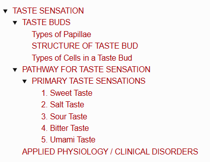
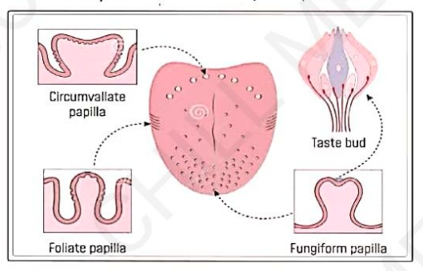
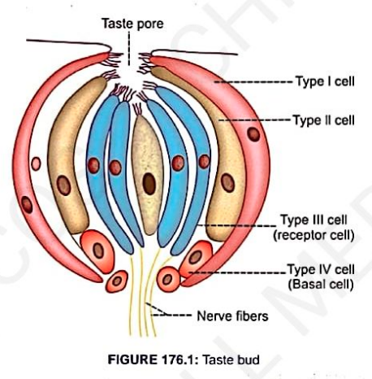
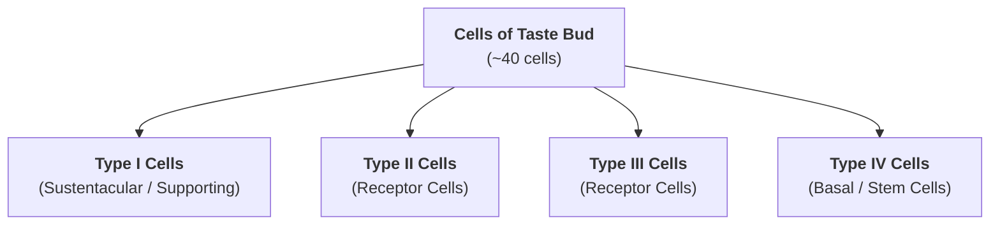
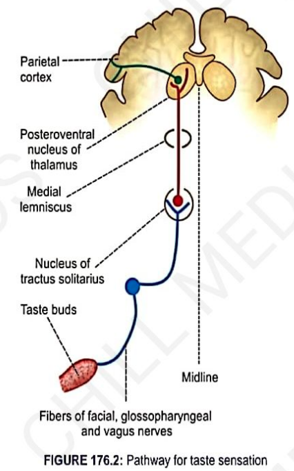
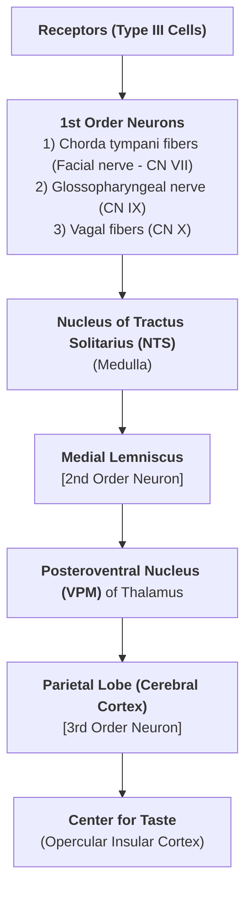
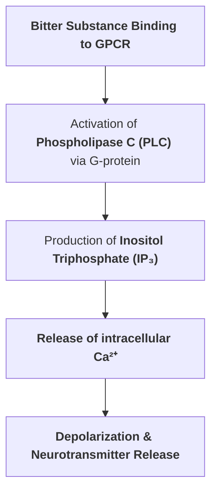

# TASTE SENSATION

> ### Headings
>  

---

## TASTE BUDS

* **Definition :** Sense organs for taste or gustatory sensation are **taste buds**.
* **Shape :** Ovoid bodies.
* **Diameter :** $30 - 70\ \mu\text{m}$.
* **Number :** Approximately **$10,000$** taste buds.
* **Distribution :** Present on the **papillae of the tongue**, and also in the mucosa of:
  * Epiglottis
  * Palate
  * Pharynx
  * Proximal oesophagus

---

### Types of Papillae

> 

<table>
  <thead>
    <tr>
      <th align="left">Type of Papilla</th>
      <th align="left">Shape & Characteristics</th>
      <th align="left">Location on Tongue</th>
    </tr>
  </thead>
  <tbody>
    <tr>
      <td><b>(a) Filiform</b></td>
      <td>Small, conical</td>
      <td>Over the anterior two-thirds of the tongue surface</td>
    </tr>
    <tr>
      <td><b>(b) Fungiform</b></td>
      <td>Round, mushroom-shaped</td>
      <td>Near the tip and margins of the tongue</td>
    </tr>
    <tr>
      <td><b>(c) Circumvallate</b></td>
      <td>Large, prominent cup-shaped</td>
      <td>Posterior part of the tongue (in front of sulcus terminalis)</td>
    </tr>
  </tbody>
</table>

---

### STRUCTURE OF TASTE BUD

* **Organization :** A bundle of taste receptor cells with supporting cells embedded together.
* **Cell Count :** Each taste bud contains approximately **$40\text{ cells}$**.
* **Taste Pore :** There is a small apical opening called the **taste pore**.

---

### Types of Cells in a Taste Bud

> 

* **Functional Categorization :**
* **Receptor Cells :** Type II and Type III cells act as **taste receptor cells**.
* **Supporting Cells :** Type I and Type IV cells serve as **supporting / basal cells**.
* **Microvilli :** Type I, Type II, and Type III cells have **microvilli** projecting towards the taste pore.

## PATHWAY FOR TASTE SENSATION

> 

---

### PRIMARY TASTE SENSATIONS

* **5 Primary Types :**
* (a) **Sweet**
* (b) **Salt**
* (c) **Sour**
* (d) **Bitter**
* (e) **Umami**

* **Flavor Complexity :** Over **100 different tastes** can be perceived by combining these 5 primary tastes.

---

#### 1. Sweet Taste

* **Organic Substances :** Produced mainly by mono- and polysaccharides, glycerol, alcohol, and ketones.
* **Inorganic Substances :** Lead and beryllium also impart a sweet taste.
* **Receptors & Mechanism :**
  * Receptor type is a **GPCR (G-Protein Coupled Receptor)**.
  * Sweet substances induce depolarization through the **cyclic AMP ($\text{cAMP}$)** pathway.

---

#### 2. Salt Taste

* **Stimulants :** Produced by ionized salts, specifically anions and cations of **chlorides, nitrates, sulphates, bromides, and iodides**.
* **Receptor :** Epithelial Sodium Channel ($\text{ENaC}$).
* **Mechanism :** Influx of $\text{Na}^+$ through $\text{ENaC}$ causes depolarization and stimulates the release of neurotransmitters (such as glutamate).

---

#### 3. Sour Taste
* **Stimulus :** Produced by $\text{H}^+$ ions present in acids and acid salts.
* **Receptor & Channels :**
  * Epithelial sodium channel ($\text{ENaC}$).
  * **$\text{HCN}$** (Hyperpolarization-activated cyclic nucleotide-gated cation channel).
* **Mechanism :** Entry / blockage by $\text{H}^+$ ions leads to cell depolarization.

---

#### 4. Bitter Taste
* **Stimulants :** Organic substances including **quinine, strychnine, morphine, picric acid, and bile salts**; certain cations also elicit a bitter sensation.
* **Receptor Type :** **GPCR** (G-Protein Coupled Receptor / $\text{T2R}$ family).
* **Transduction Pathway :**

---

#### 5. Umami Taste

* **Stimulus :** Produced when taste buds respond to glutamate, particularly **Monosodium Glutamate (MSG)**.
* **Receptor :** Metabotropic glutamate receptor (**$\text{mGluR}_4$**).
* **Mechanism :** Binding of glutamate activates intracellular cascades leading to depolarization.

---

## APPLIED PHYSIOLOGY / CLINICAL DISORDERS

* **1. Ageusia :** Complete loss of taste sensation.
* **Lesion of Facial Nerve (CN VII) / Chorda Tympani / Mandibular Division of Trigeminal (CN V3) :** Causes loss of taste sensation in the **anterior $2/3^{\text{rd}}$** of the tongue.
* **Lesion of Glossopharyngeal Nerve (CN IX) :** Causes loss of taste sensation in the **posterior $1/3^{\text{rd}}$** of the tongue.
* **Drug-Induced (Temporary Loss) :** Caused by medications such as **captopril** and **penicillamine**.

* **2. Hypogeusia :** $\downarrow$ Decreased taste sensation.
* **3. Dysgeusia / Parageusia :** Disturbed or altered taste sensation (commonly seen in **Temporal Lobe Syndrome**).
* **4. Taste Blindness :** Rare genetic condition in which the ability to taste and recognize specific substances (e.g., Phenylthiocarbamide / PTC) is completely lost.
